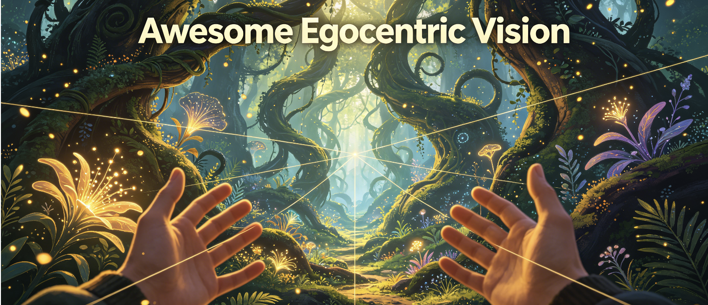

# 🎥 Awesome Egocentric Vision

  

  

> 一个精心策划、面向学习的第一视角（第一人称）视觉与具身AI资源列表：包含论文、数据集、代码、模型、工具包、挑战赛和教程，覆盖经典基础工作与前沿进展，兼顾科研入门与工业部署。

✅ **收录标准**
+ 优先来自CVPR / ICCV / ECCV / NeurIPS / ICLR / AAAI / TPAMI / TVCG 等顶级会议和期刊的高质量工作
+ 覆盖核心前沿方向：Ego-VLM/LLM，Ego-VLA具身智能，3D/4D重建，手物交互，视线估计，长视频理解，世界模型

---

## 📑 目录
1. [📚 综述与概述](#-综述与概述)
2. [🔬 核心研究方向](#-核心研究方向)
    - 2.1 动作识别、检测与预测
    - 2.2 手-物交互与细粒度活动
    - 2.3 第一视角视觉-语言模型与多模态推理
    - 2.4 长视频理解与结构化推理
    - 2.5 视线、注意力与意图预测
    - 2.6 3D/4D重建与结构化感知
    - 2.7 具身AI与视觉-语言-动作（Ego-VLA）
    - 2.8 第一视角世界模型
    - 2.9 第一视角流程式AI助手
    - 2.10 第一视角数据安全与隐私保护
3. [📊 数据集、基准与模拟器](#-数据集基准与模拟器)
4. [👓 智能眼镜专属研究与部署](#-智能眼镜专属研究与部署)
5. [🔗 相关Awesome列表](#-相关awesome列表)
6. [🎯 关键研究挑战](#-关键研究挑战)

---

## 📚 综述与概述
本领域入门首选材料，帮助快速建立全局认知，梳理发展脉络、核心任务和关键挑战。

+  **Challenges and Trends in Egocentric Vision: A Survey**
    - 发表：arXiv 2025（v1: 2025年3月，v2: 2025年4月）
    - 亮点：领域最新全景综述，系统分类四大任务方向：主体理解、物体理解、环境理解和混合理解，全面总结挑战与趋势
    - 论文链接：[arXiv](https://arxiv.org/abs/2503.15275)
    - 微信文章：https://mp.weixin.qq.com/s/Nm1UOZ8wa3VnXNNeAQMiHw

+  **Building Egocentric Procedural AI Assistant: Methods, Benchmarks, and Challenges**
    - 发表：arXiv 2025
    - 亮点：首次系统提出第一人称流程式AI助手的完整技术框架，定义三大核心任务：错误检测、流程学习和视觉问答，以及两个支撑维度：实时流处理和主动交互
    - 论文链接：[arXiv](https://arxiv.org/abs/2511.13261)

+  **Bridging Perspectives: A Survey on Cross-view Collaborative Intelligence with Egocentric-Exocentric Vision**
    - 发表：arXiv 2025
    - 亮点：系统梳理第一视角-外部视角协同学习方向，涵盖三种范式：外部辅助第一视角、第一视角辅助外部和联合学习
    - 论文链接：[arXiv](https://arxiv.org/abs/2506.06253)

+ **An Outlook into the Future of Egocentric Vision**
    - 发表：IJCV 2024
    - 亮点：领域权威学者合著，结合可穿戴计算未来场景，梳理研究短板和待突破方向
    - 论文链接：[arXiv](https://arxiv.org/abs/2308.07123)

+ **First-Person Vision**
    - 发表：Proceedings of the IEEE 2012
    - 亮点：领域奠基性综述，首次正式定义第一人称视觉的研究范围、核心挑战和应用方向
    - 论文链接：[IEEE Xplore](https://ieeexplore.ieee.org/document/6232429)

---

## 🔬 核心研究方向

### 2.1 动作识别、检测与预测
第一视角视觉中最基础且最成熟的方向，研究从第一人称视角识别、检测和预测人类动作。

#### 动作识别与检测
+  **Divide, Deliberate, Decide: A Multi-Agent Framework for Fine-Grained Egocentric Action Recognition**
    - 发表：arXiv 2026（2026年6月）
    - 亮点：一个完全本地、零样本的多智能体框架，VLM专家进行结构化商议和同行咨询，提升零样本动作识别性能
    - 论文链接：[arXiv](https://arxiv.org/abs/2606.17627)

+  **From Frames to Temporal Graphs: In-Context Egocentric Action Recognition with Vision-Language Models**
    - 发表：arXiv 2026（2026年6月）
    - 亮点：提出将视频转换为时序动作图，配合多阶段提示流程，在11个开源VLM（2B至235B参数）上实现高效上下文少样本学习
    - 论文链接：[arXiv](https://arxiv.org/abs/2606.15417)

+  **Cross-Modal Action Recognition in Egocentric Video Using Mamba: Integrating RGB and Hand Skeleton Streams via CLS Token Fusion Strategies**
    - 发表：EgoVis@CVPR 2026（arXiv 2026年5月）
    - 亮点：基于Mamba框架的跨模态架构，融合RGB视频和时序手部骨架数据，提出四种CLS令牌融合策略
    - 论文链接：[arXiv](https://arxiv.org/abs/2605.24302)

+  **EgoAction: Egocentric Action Composition with Reliability-Aware Temporal Fusion**
    - 发表：CVPR 2026（EPIC-KITCHENS挑战赛冠军方案）
    - 亮点：提出解耦的动词-名词检测+动态加权融合策略，基于VideoMAE-L特征在长未修剪视频上达到SOTA精度
    - 论文链接：[arXiv](https://arxiv.org/abs/2605.24496)

+  **ENIGMA-360: An Ego-Exo Dataset for Human Behavior Understanding in Industrial Scenarios**
    - 发表：arXiv 2026（2026年3月）
    - 亮点：为三个基础任务提供基线实验：时序动作分割、关键步骤识别和第一视角人-物交互检测
    - 论文链接：[arXiv](https://arxiv.org/abs/2603.14327)

+  **Ego4OOD: Rethinking Egocentric Video Domain Generalization via Covariate Shift Scoring**
    - 发表：arXiv 2026（2026年1月）
    - 亮点：提出Ego4OOD域泛化基准，包含8个地理分布不同的域，并引入基于聚类的协变量偏移度量
    - 论文链接：[arXiv](https://arxiv.org/abs/2601.17056)

+  **Continual Multimodal Egocentric Activity Recognition via Modality-Aware Novelty Detection**
    - 发表：arXiv 2026
    - 亮点：提出MAND模态感知框架，新活动检测AUC提升10%
    - 论文链接：[arXiv](https://arxiv.org/abs/2603.16970)

+  **Ego-METAS: Egocentric online Multimodal Energy-efficient Temporal Action Segmentation benchmark**
    - 发表：arXiv 2026
    - 亮点：首个面向能量感知的在线多模态时序动作分割基准，包含100+小时未修剪视频，覆盖5种模态
    - 论文链接：[arXiv](https://arxiv.org/abs/2606.02246)

+  **MM-CDFSL: Multimodal Cross-Domain Few-Shot Learning for Egocentric Action Recognition**
    - 发表：ECCV 2024
    - 亮点：首次系统研究第一视角动作识别的跨域少样本场景，提出多模态蒸馏框架
    - 论文链接：[arXiv](https://arxiv.org/abs/2405.19917)

+ **Ego-Only: Egocentric Action Detection without Exocentric Transferring**
    - 发表：ICCV 2023
    - 亮点：首次证明仅用第一人称数据训练的模型可以超越依赖第三人称迁移的方法
    - 论文链接：[CVF](https://openaccess.thecvf.com/content/ICCV2023/html/Wang_Ego-Only_Egocentric_Action_Detection_without_Exocentric_Transferring_ICCV_2023_paper.html)

#### 动作预测
+  **INSIGHT: Intention-Guided Cognitive Reasoning for Egocentric Long-Term Action Anticipation**
    - 发表：AAAI 2026
    - 亮点：提出“HOI语义识别+意图推理”两阶段框架用于长期动作预测
    - 论文链接：[arXiv](https://arxiv.org/abs/2508.01742)

+  **PALM: Predicting Actions through Language Models**
    - 发表：arXiv 2023
    - 亮点：首次将大语言模型引入长期时序动作预测
    - 论文链接：[arXiv](https://arxiv.org/abs/2311.17944)

+  **GANO: Gaze-Augmented Next Active Object-Based Egocentric Action Anticipation**
    - 发表：arXiv 2023
    - 亮点：针对下一个活动对象预测任务，提出视线引导的注意力机制
    - 论文链接：[arXiv](https://arxiv.org/abs/2305.12953)

#### 📊 相关数据集与基准
| 数据集名称 | 年份 | 规模 | 核心任务 | 链接 |
| :--- | :--- | :--- | :--- | :--- |
| EgoScale | 2026 | 20k+ 小时标注操作 | 动作识别，灵巧迁移 | [arXiv](https://arxiv.org/abs/2602.16710) |
| Ego-METAS | 2026 | 100+ 小时 / 5种模态 | 在线动作分割，传感器路由 | [Hugging Face](https://huggingface.co/datasets/Ego-METAS/Ego-METAS) |
| ChildLens | 2026 | 108.58 小时 / 354个视频 | 儿童日常活动分析 | [Data](https://doi.org/10.17617/4.fe) |
| CogDrive (EyeCue) | 2026 | 多场景驾驶 | 驾驶员认知分心检测 | [arXiv](https://arxiv.org/abs/2605.07859) |
| Furhat Egocentric Dataset | 2026 | 20个序列 / ~25分钟 | 机器人-第一视角面部/身体跟踪 | [arXiv](https://arxiv.org/abs/2606.03694) |
| World In Your Hands | 2025 | 1000+ 小时标注操作 | 动作识别，VLA训练 | [GitHub](https://github.com/tars-robotics/World-In-Your-Hands) |
| EgoCampus | 2025 | ~32 小时 | 视线，行人第一视角 | [GitHub](https://github.com/ComputerVisionRutgers/EgoCampus) |
| AEA | 2024 | 143个序列 / ~7.3小时 | 日常活动（Aria） | [Project Aria](https://www.projectaria.com/datasets/aea/) |
| EgoSurgery | 2024 | 开放手术视频 | 手术阶段，工具检测 | [GitHub](https://github.com/Fujiry0/EgoSurgery) |
| EgoExo-Fitness | 2024 | 32小时 / 1,276个序列 | 全身动作，质量评估 | [GitHub](https://github.com/iSEE-Laboratory/EgoExo-Fitness) |
| E³ (Exploring Embodied Emotion) | 2024 | 50+ 小时 | 情绪识别，多模态 | [GitHub](https://github.com/Exploring-Embodied-Emotion-official/E3) |
| ⭐ Ego4D | 2022 | ~3,670 小时 | 动作识别，VQA，预测等 | [官方网站](https://ego4d-data.org/) |
| ⭐ EPIC-KITCHENS-100 | 2021 | 100小时 / 90K片段 | 动作识别，检测，预测 | [官方网站](https://epic-kitchens.github.io/) |
| EGOFALLS | 2023 | 摔倒样本 | 摔倒检测 | [Dataverse](https://www.dataverse.nl/dataset.xhtml?persistentId=doi:10.34894/HO5GE3) |
| Epic-Sounding-Object | 2023 | 3.2K短片段 | 音视频物体定位 | [GitHub](https://github.com/WikiChao/Ego-AV-Loc) |
| HoloAssist | 2023 | 169小时 | 交互式助手 | [官方网站](https://holoassist.github.io/) |
| WEAR | 2023 | ~19小时户外运动 | 活动 + IMU | [官方网站](https://mariusbock.github.io/wear/) |
| N-EPIC-KITCHENS | 2022 | 事件 + RGB子集 | 神经形态动作识别 | [GitHub](https://github.com/EgocentricVision/N-EPIC-Kitchens) |
| Ego-Deliver | 2021 | 5,360个视频 | 配送行为分析 | [官方网站](https://egodeliver.github.io/) |
| HOMAGE | 2021 | 30小时 | 家庭活动组合理解 | [GitHub](https://github.com/nishantrai18/homage) |
| MECCANO | 2021 | ~55小时工业 | 手-物交互，工业 | [官方网站](https://iplab.dmi.unict.it/MECCANO/) |
| EGO-CH | 2020 | 27+ 小时 | 游客行为，POI任务 | [arXiv](https://arxiv.org/abs/2002.00899) |
| EgoCom | 2020 | 38.5小时对话 | 多人第一视角对话 | [GitHub](https://github.com/facebookresearch/EgoCom-Dataset) |
| LEMMA | 2020 | 多视角活动 | 多智能体任务 | [GitHub](https://github.com/Buzz-Beater/LEMMA) |
| Charades-Ego | 2018 | 配对ego/exo | 对齐，动作 | [官方网站](https://prior.allenai.org/projects/charades-ego) |
| EGTEA Gaze+ | 2018 | 28小时烹饪 | 视线 + 动作识别 | [官方网站](https://cbs.ic.gatech.edu/fpv/) |
| EgoGesture | 2017 | 2K+ 视频 / 24K样本 | 手势识别 | [官方网站](https://nlpr.ia.ac.cn/iva/yfzhang/datasets/egogesture.html) |
| Stanford ECM | 2017 | 31小时 | 日常活动分类 | [CVF](https://openaccess.thecvf.com/content_cvpr_2017/html/Nakamura_Jointly_Learning_Energy_CVPR_2017_paper.html) |
| THU-READ | 2017 | 1,920个片段 | 头盔RGB-D动作 | [官方网站](https://ivg.au.tsinghua.edu.cn/dataset/THU_READ.php) |
| PEV | 2016 | 1,226对 | 两人对话微动作 | [CVF](https://openaccess.thecvf.com/content_cvpr_2016/html/Yonetani_Recognizing_Micro-Actions_and_CVPR_2016_paper.html) |
| FPPA | 2015 | 5名受试者 | 日常动作 + 手/视线 | [CVF](https://openaccess.thecvf.com/content_iccv_2015/html/Zhou_Temporal_Perception_and_ICCV_2015_paper.html) |
| JPL-Interaction | 2013 | 84个视频 | 第一人称活动识别 | [官方网站](http://michaelryoo.com/jpl-interaction.html) |
| ADL | 2012 | ~10小时 | 日常活动识别 | [官方网站](https://www.csee.umbc.edu/~hpirsiav/papers/ADLdataset/) |
| Social Interactions | 2012 | ~60小时 | 社交活动 | [官方网站](https://cbs.ic.gatech.edu/fpv/) |
| EgoAction (Sports) | 2011 | 第一人称体育视频 | 动作识别 | [IEEE](https://doi.org/10.1109/CVPR.2011.5995406) |

---

### 2.2 手-物交互与细粒度活动
研究从第一人称视角观察手与物体的交互过程，是具身智能和机器人模仿学习的核心基础。

+  **Hand-4DGS: Feed-Forward 3D Gaussian Splatting for 4D Hand Reconstruction from Egocentric Videos**
    - 发表：arXiv 2026（2026年6月）
    - 亮点：从第一视角视频进行动态3D手部重建，对AR/VR和AI眼镜至关重要，解决快速头部运动、快速手部动态、严重遮挡和单视角模糊问题
    - 论文链接：[arXiv](https://arxiv.org/abs/2606.16930)

+  **Hand Trajectory Fusion for Egocentric Natural Language Query Grounding**
    - 发表：EgoVis@CVPR 2026（arXiv 2026年6月）
    - 亮点：首次将手部运动线索引入NLQ定位任务，在手-物交互查询上R@1, IoU=0.3提升2.54%
    - 论文链接：[arXiv](https://arxiv.org/abs/2606.02962)

+  **Wh0: Generative World Models as Scalable Sources of Egocentric Human Hand Manipulation Data**
    - 发表：arXiv 2026（2026年6月）
    - 亮点：使用生成式视频世界模型作为可扩展、可控的第一视角人手操作数据源，解锁预训练灵巧VLA模型的操作能力
    - 论文链接：[arXiv](https://arxiv.org/abs/2606.22136)

+  **TouchAnything: A Dataset and Framework for Bimanual Tactile Estimation from Egocentric Video**
    - 发表：arXiv 2026（2026年5月）
    - 亮点：引入EgoTouch，一个大规模多视角第一视角数据集，带有双手手-物交互的密集触觉监督，包含208个操作任务，共1,891个片段
    - 论文链接：[arXiv](https://arxiv.org/abs/2605.13083)

+  **IMPACT-HOI: Supervisory Control for Onset-Anchored Partial HOI Event Construction**
    - 发表：arXiv 2026（2026年5月）
    - 亮点：一个混合主动框架，用于标注第一视角流程视频，构建人-物交互的结构化事件图，动机是从人类演示中学习机器人操作
    - 论文链接：[arXiv](https://arxiv.org/abs/2605.17639)

+  **EgoForce: Forearm-Guided Camera-Space 3D Hand Pose from a Monocular Egocentric Camera**
    - 发表：SIGGRAPH 2026（arXiv 2026年5月）
    - 亮点：可微分前臂表示 + 统一手臂-手Transformer。在HOT3D上所有镜头类型MPJPE降低28%
    - 论文链接：[arXiv](https://arxiv.org/abs/2605.12498)

+  **EgoGrasp: World-Space Hand-Object Interaction Estimation from Egocentric Videos**
    - 发表：arXiv 2026（2026年3月）
    - 亮点：首个从动态第一视角视频重建世界空间手-物交互（W-HOI）的方法，支持开放词汇物体
    - 论文链接：[arXiv](https://arxiv.org/abs/2603.12255)

+  **EgoHOI: Egocentric World Model for Photorealistic Hand-Object Interaction Synthesis**
    - 发表：arXiv 2026（2026年3月）
    - 亮点：首个第一视角HOI世界模型，将物理先验嵌入生成扩散模型，从3D估计中提取几何和运动学先验为物理感知嵌入
    - 论文链接：[arXiv](https://arxiv.org/abs/2603.13615)

+  **Glove2Hand: Synthesizing Natural Hand-Object Interaction from Multi-Modal Sensing Gloves**
    - 发表：CVPR 2026（Highlight）
    - 亮点：从多模态传感手套数据生成逼真的裸手HOI视频，并附带HandSense数据集
    - 论文链接：[arXiv](https://arxiv.org/abs/2603.20850)

+  **TOUCH: Text-Guided Controllable Generation of Free-Form Hand-Object Interactions**
    - 发表：ICLR 2026
    - 亮点：提出自由形式HOI生成任务，构建大规模WildO2 3D HOI数据集
    - 论文链接：[OpenReview](https://openreview.net/forum?id=4VW9HVCRw0)

+  **Leveraging Synthetic Data for Enhancing Egocentric Hand-Object Interaction Detection**
    - 发表：IJCV 2026, Vol.134
    - 亮点：仅使用少量真实标注数据结合合成数据，在VISOR上AP提升11.69%，并开源HOI-Synth合成数据生成流程
    - 论文链接：[Springer](https://link.springer.com/article/10.1007/s11263-026-02838-8)

+  **ECHO: Ego-Centric modeling of Human-Object interactions**
    - 发表：arXiv 2025（v1: 2025年8月，v2: 2026年3月）
    - 亮点：首个统一框架，仅从头部和手腕追踪恢复人体姿态、物体运动和接触动力学，使用新颖的三变量扩散过程与独立噪声调度
    - 论文链接：[arXiv](https://arxiv.org/abs/2508.21556)

+  **MEgoHand: Multimodal Egocentric Hand-Object Interaction Motion Generation**
    - 发表：NeurIPS 2025
    - 亮点：提出双层架构框架，高层使用VLM推断运动先验，低层基于DiT流匹配生成细粒度轨迹
    - 论文链接：[NeurIPS](https://proceedings.neurips.cc/paper_files/paper/2025/hash/469c396a192043e3d70c04bdb3e5a532-Abstract-Conference.html)

+  **EgoAERO: Learning Dexterous Manipulation from a Single Egocentric Video without Object Assets**
    - 发表：arXiv 2026
    - 亮点：无需预先扫描物体资产的灵巧操作学习框架，构建大规模EgoDex-R数据集（4.3M RGB-D帧）
    - 论文链接：[arXiv](https://arxiv.org/abs/2606.08057)

+  **EgoInteract: Synthetic Egocentric Videos Generation for Interaction Understanding and Anticipation**
    - 发表：arXiv 2026
    - 亮点：一个可控的第一视角视频生成模拟器，实现相机、人体动作和物体操作的精确控制
    - 论文链接：[arXiv](https://arxiv.org/abs/2605.18214)

+  **EgoHandICL: Egocentric 3D Hand Reconstruction with In-Context Learning**
    - 发表：arXiv 2026（2026年1月）
    - 亮点：第一视角视觉中的鲁棒3D手部重建，解决深度模糊、自遮挡和复杂手-物交互；提升EgoVLM手-物交互推理
    - 论文链接：[arXiv](https://arxiv.org/abs/2601.09806)

+  **Do Egocentric Video-Language Models Truly Understand Hand-Object Interactions?**
    - 发表：ICLR 2025
    - 亮点：首次系统评估第一视角VLM对细粒度HOI的理解能力，提出EgoHOIBench基准
    - 论文链接：[arXiv](https://arxiv.org/abs/2405.17719)

+  **HOI-Ref: Hand-Object Interaction Referral in Egocentric Vision**
    - 发表：arXiv 2024
    - 亮点：定义第一视角场景中HOI指代新任务，附带HOI-QA评估基准
    - 论文链接：[arXiv](https://arxiv.org/abs/2404.09933)

+  **Get a Grip: Reconstructing Hand-Object Stable Grasps in Egocentric Videos**
    - 发表：arXiv 2023
    - 亮点：首次从单目第一视角视频重建稳定的手-物抓取状态
    - 论文链接：[arXiv](https://arxiv.org/abs/2312.15719)

+ **EgoPCA: A New Framework for Egocentric Hand-Object Interaction Understanding**
    - 发表：ICCV 2023
    - 亮点：提出新框架作为基础设施，通过探测、筛选和适应（EgoPCA）推动Ego-HOI识别
    - 论文链接：[CVF](https://openaccess.thecvf.com/content/ICCV2023/html/EgoPCA_A_New_Framework_for_Egocentric_Hand-Object_Interaction_Understanding_ICCV_2023_paper.html)

#### 📊 相关数据集与基准
| 数据集名称 | 年份 | 规模 | 核心任务 | 链接 |
| :--- | :--- | :--- | :--- | :--- |
| ⭐ EgoDex | 2025 | 829小时 / 30K轨迹 | 灵巧操作，手部姿态 | [GitHub](https://github.com/apple/ml-egodex) |
| EgoDex-R | 2026 | 4.3M RGB-D帧 / 5.6K序列 | 灵巧操作，手-物姿态 | [arXiv](https://arxiv.org/abs/2606.08057) |
| EgoTouch | 2026 | 1,891个片段 / 208个任务 | 触觉HOI | [Hugging Face](https://huggingface.co/datasets/zhenyuxie-zhzh/EgoTouch_hdf5) |
| EgoTactile | 2026 | ~6小时 / 768个片段 | 抓握压力估计 | [官方网站](https://egotactile.github.io/) |
| EventEgoHands | 2026 | 48个片段 / 129.6K帧 | RGB+事件手部检测 | [GitHub](https://github.com/SynthSyntax/EventEgoHands) |
| HA-Ego-1K | 2026 | ~24小时 / 484个多视角片段 | 灵巧操作 | [Hugging Face](https://huggingface.co/datasets/humanarchive/HA-Ego-1K) |
| DexGloveHOI | 2026 | 3.5小时 / 100K+样本 | 视觉-IMU 3D手部跟踪 | [arXiv](https://arxiv.org/abs/2605.21714) |
| EgoEVHands | 2026 | 5,419个标注序列 | 立体事件3D手部姿态 | [GitHub](https://github.com/ZJUWang01/EgoEV-HandPose) |
| EgoEMG | 2026 | 41名参与者 / 10+小时 | EMG+视觉手部姿态 | [GitHub](https://github.com/zhenqis123/EgoEMG) |
| HRDexDB | 2026 | 1.4K次抓握试验 | 灵巧抓握，触觉 | [Hugging Face](https://huggingface.co/datasets/hahahataeyun/hrdexdb) |
| TouchMoment | 2026 | 4,021个视频 / 8,456个接触时刻 | 接触时刻检测 | [arXiv](https://arxiv.org/abs/2604.12343) |
| EgoFun3D | 2026 | 271个第一视角视频 | 交互式3D物体 | [官方网站](https://3dlg-hcvc.github.io/EgoFun3D/) |
| SHOW3D | 2026 | 野外ego-exo HOI | 3D手-物标注 | [arXiv](https://arxiv.org/abs/2603.28760) |
| FEEL | 2026 | 力同步厨房视频 | 物理动作理解 | [官方网站](https://www.cs.umd.edu/~edessale/feel) |
| EgoPoints | 2025 | 点轨迹 + 合成 | 第一视角视频追踪 | [GitHub](https://github.com/AhmadDarKhalil/EgoPoints) |
| ⭐ HOI4D | 2022 | 2.4M帧 / 4K序列 | 4D HOI | [官方网站](https://hoi4d.github.io/) |
| AssemblyHands | 2023 | 3M图像 | 3D手部姿态 | [官方网站](https://assemblyhands.github.io/) |
| EgoObjects | 2023 | 9.2K+ 视频 | 检测，实例分割 | [GitHub](https://github.com/facebookresearch/EgoObjects) |
| ENIGMA-51 | 2023 | 22小时工业 | 细粒度行为 | [官方网站](https://fpv-iplab.github.io/ENIGMA-51/) |
| POV-Surgery | 2023 | ~88K帧（合成） | 外科手-工具姿态 | [官方网站](https://batfacewayne.github.io/POV_Surgery_io/) |
| VOST | 2023 | 713个视频 | 视频对象分割 | [官方网站](https://www.vostdataset.org/) |
| EgoBody | 2022 | 125个序列 | 身体姿态，交互 | [官方网站](https://egobody.ethz.ch/) |
| EgoHOS | 2022 | 11K+ 图像 | 手-物分割 | [GitHub](https://github.com/owenzlz/EgoHOS) |
| EgoPAT3D | 2022 | 1M+ 帧 RGB-D | 3D动作目标预测 | [GitHub](https://github.com/ai4ce/EgoPAT3D) |
| Touch and Go | 2022 | 12K+ 视觉-触觉帧 | 视觉 + 触觉 | [官方网站](https://touch-and-go.github.io/) |
| VISOR | 2022 | EPIC + 掩码 | 分割，HOI | [官方网站](https://epic-kitchens.github.io/VISOR/) |
| H2O | 2021 | 100K+ 帧 | 双手交互 | [官方网站](https://h2odataset.ethz.ch/) |
| TREK-150 | 2021 | 150个EPIC序列 | 对象追踪 | [官方网站](https://machinelearning.uniud.it/datasets/trek150/) |
| You2Me | 2020 | 14个序列 | 通过ego-exo推断身体姿态 | [GitHub](https://github.com/facebookresearch/you2me) |
| FPHA | 2018 | 1.2K序列 | 手部姿态 + 动作 | [官方网站](https://guiggh.github.io/publications/first-person-hands/) |
| EgoDexter | 2017 | ~3.2K帧 | 遮挡下的手部追踪 | [官方网站](https://handtracker.mpi-inf.mpg.de/projects/OccludedHands/EgoDexter.htm) |
| EgoHands | 2015 | 4.8K标注帧 | 手部检测 | [官方网站](http://vision.soic.indiana.edu/projects/egohands/) |
| BEOID | 2014 | 58个视频 | 手-物交互 | [官方网站](https://data.bris.ac.uk/data/dataset/3wats8ruq1sp52hq3bo8dkzul3) |
| EDSH | 2013 | 2个视频 | 像素级手部分割 | [官方网站](http://www.cs.cmu.edu/~kkitani/datasets/) |
| Handled Objects | 2009 | 11个类别 | 抓取序列 | [IEEE](https://doi.org/10.1109/CVPRW.2009.5204360) |

---

### 2.3 第一视角视觉-语言模型与多模态推理
将大语言模型与第一人称视觉结合，实现视频问答、内容描述和推理等高级认知能力。本节还涵盖结合RGB、深度、IMU、音频和视线信号的多模态融合方法。

#### 预训练基础模型
+  **EgoM2P: Egocentric Multimodal Multitask Pretraining**
    - 发表：ICCV 2025
    - 亮点：统一设计支持多种第一视角感知和合成任务的多任务处理，包括视线预测、第一视角相机跟踪和单目深度估计，也可作为条件第一视角视频合成的生成模型
    - 论文链接：[ICCV](https://openaccess.thecvf.com/content/ICCV2025/html/EgoM2P_Egocentric_Multimodal_Multitask_Pretraining_ICCV_2025_paper.html)

+  **EgoAdapt: Adaptive Multisensory Distillation and Policy Learning for Efficient Egocentric Perception**
    - 发表：ICCV 2025
    - 亮点：自适应执行跨模态蒸馏和策略学习的框架，实现不同第一视角感知任务的高效推理，包括动作识别、主动说话人定位和行为预测。GMACs降低高达89.09%，参数降低82.02%，能耗降低9.6倍
    - 论文链接：[ICCV](https://www.openaccess.thecvf.com/content/ICCV2025/html/Chowdhury_EgoAdapt_Adaptive_Multisensory_Distillation_and_Policy_Learning_for_Efficient_Egocentric_ICCV_2025_paper.html) | [arXiv](https://arxiv.org/abs/2506.21080)

+ **EgoVLPv2: Egocentric Video-Language Pre-training with Fusion in the Backbone**
    - 发表：ICCV 2023
    - 亮点：改进的VLP，采用骨干网融合架构
    - 论文链接：[arXiv](https://arxiv.org/abs/2307.05463)

+ **Egocentric Video-Language Pretraining (EgoVLP)**
    - 发表：CVPR 2022
    - 亮点：首个专为第一视角场景设计的视频-语言预训练框架
    - 论文链接：[arXiv](https://arxiv.org/abs/2206.01670)

#### 高级推理与前沿进展
+  **EgoSAT: A Comprehensive Benchmark of Egocentric Streaming Interaction Understanding**
    - 发表：ECCV 2026（arXiv 2026年6月）
    - 亮点：首个面向流式设置的第一视角视频推理综合基准，设计用于评估VLM在流式交互理解上的表现。包含1,997个独特视频，跨越165小时，约4,800个QA对
    - 论文链接：[arXiv](https://arxiv.org/abs/2606.24422)

+  **PROSE: Training-Free Egocentric Scene Registration with Vision-Language Models**
    - 发表：arXiv 2026（2026年6月）
    - 亮点：使用预训练VLM作为场景理解和跨扫描匹配的来源进行第一视角场景配准，性能优于几何和学习的场景图基线
    - 论文链接：[arXiv](https://arxiv.org/abs/2606.16569)

+  **Decoding Pedestrian Crossing Intention from Egocentric Vision via Vision Language Models**
    - 发表：arXiv 2026（2026年6月）
    - 亮点：首次使用VLM解码行人过街意图，融合眼动和自我运动后准确率提升14.5%
    - 论文链接：[arXiv](https://arxiv.org/abs/2606.09142)

+  **The Right Inference Strategy Is All You Need: Nearly Training-Free Domain-Wise Inference for EgoCross Challenge**
    - 发表：arXiv 2026（2026年5月）
    - 亮点：EgoCross挑战赛解决方案，域感知推理策略在仅20个训练样本下达到66.98%准确率
    - 论文链接：[arXiv](https://arxiv.org/abs/2606.00829)

+  **Spatial Reasoning with Vision-Language Models in Ego-Centric Multi-View Scenes**
    - 发表：ICLR 2026（2026年4月）
    - 亮点：提出Ego3D-Bench空间推理基准（8,600+ QA对），以及Ego3D-VLM后训练框架
    - 论文链接：[arXiv](https://arxiv.org/abs/2509.06266)

+  **EgoMotion: Hierarchical Reasoning and Diffusion for Egocentric Vision-Language Motion Generation**
    - 发表：arXiv 2026（2026年4月）
    - 亮点：提出分层推理和扩散框架，从第一人称视频生成语言描述的3D人体运动
    - 论文链接：[arXiv](https://arxiv.org/abs/2604.19105)

+  **Exo2Ego: Exocentric Knowledge Guided Multimodal LLMs for Egocentric Video Understanding**
    - 发表：AAAI 2026（2026年2月）
    - 亮点：构建Ego-ExoClip预训练数据集（110万同步第一视角-外部中心片段-文本对），提出三阶段渐进映射学习流程
    - 论文链接：[AAAI](https://ojs.aaai.org/index.php/AAAI/article/view/38244)

+  **Egocentric Bias in Vision-Language Models**
    - 发表：arXiv 2026（2026年2月）
    - 亮点：引入FlipSet，一个用于VLM二级视觉视角采样的诊断基准。评估103个VLM揭示系统性第一视角偏差：绝大多数表现低于随机水平
    - 论文链接：[arXiv](https://arxiv.org/abs/2602.03953)

+  **Allocentric Perceiver: Disentangling Allocentric Reasoning from Egocentric Visual Priors via Frame Instantiation**
    - 发表：arXiv 2026（2026年2月）
    - 亮点：一种免训练的异中心感知策略，从单张或多张图像恢复度量3D状态，在异中心任务上提升约10%
    - 论文链接：[arXiv](https://arxiv.org/abs/2602.05789)

+  **Cognitively-Inspired Tokens Overcome Egocentric Bias in Multimodal Models**
    - 发表：arXiv 2026（2026年1月）
    - 亮点：多模态语言模型在语义视觉-语言任务上表现良好，但在需要采用另一个智能体视觉视角的空间推理上失败，反映持续的第一视角偏差
    - 论文链接：[arXiv](https://arxiv.org/abs/2601.15849)

+  **EgoThinker: Unveiling Egocentric Reasoning with Spatio-Temporal Chain of Thought**
    - 发表：NeurIPS 2025
    - 亮点：将思维链（CoT）引入第一视角视频理解，提出时空思维链框架
    - 论文链接：[arXiv](https://arxiv.org/abs/2510.23569)

+  **Towards Comprehensive Scene Understanding: Integrating First and Third-Person Views for LVLMs**
    - 发表：NeurIPS 2025
    - 亮点：提出E3VQA多视角问答基准（4K高质量QA对）和M3CoT提示技术，在GPT-4o上提升4.84%
    - 论文链接：[NeurIPS](https://proceedings.neurips.cc/paper_files/paper/2025/hash/1af83ab66b4f07a3f55788e67dab5782-Abstract-Conference.html)

+  **Benchmarking Egocentric Multimodal Goal Inference for Assistive Wearable Agents**
    - 发表：NeurIPS 2025 Datasets and Benchmarks Track
    - 亮点：目标推理基准数据集，包含363名参与者和3,482条记录，人类上限准确率93%，最佳VLM仅84%
    - 论文链接：[NeurIPS](https://proceedings.neurips.cc/paper_files/paper/2025/hash/23ab960082db936f874b171822e0d097-Abstract-Datasets_and_Benchmarks.html)

+  **ECBench: Can Multi-modal Foundation Models Understand the Egocentric World? A Holistic Embodied Cognition Benchmark**
    - 发表：CVPR 2025
    - 亮点：高质量基准，旨在系统评估LVLM的具身认知能力。具有多样场景视频源、开放式问题格式和30个具身认知维度
    - 论文链接：[CVF](https://www.openaccess.thecvf.com/content/CVPR2025/html/Dang_ECBench_Can_Multi-modal_Foundation_Models_Understand_the_Egocentric_World_A_CVPR_2025_paper.html) | [arXiv](https://arxiv.org/abs/2501.05031)

+  **MM-Ego: Towards Building Egocentric Multimodal LLMs for Video QA**
    - 发表：ICLR 2025
    - 亮点：提出MM-Ego，一个在第一视角视频理解上表现强大的第一视角多模态LLM
    - 论文链接：[arXiv](https://arxiv.org/abs/2410.07177) | [OpenReview](https://openreview.net/forum?id=7k9a8b7s9d)

+  **CLiViS: Unleashing Cognitive Map through Linguistic-Visual Synergy for Embodied Visual Reasoning**
    - 发表：arXiv 2025
    - 亮点：通过语言-视觉协同构建认知地图，突破长视频推理瓶颈
    - 论文链接：[arXiv](https://arxiv.org/abs/2506.17629)

+  **PhysBrain: Human Egocentric Data as a Bridge from Vision Language Models to Physical Intelligence**
    - 发表：arXiv 2025
    - 亮点：将第一人称人类视频转换为具身监督数据
    - 论文链接：[arXiv](https://arxiv.org/abs/2512.16793)
    - 微信文章：https://mp.weixin.qq.com/s/Eydrv6aj3q6Km6TRmfnBBQ

+  **Vinci: A Real-time Smart Assistant based on Egocentric Vision-language Model**
    - 发表：ACM 2025（arXiv 2024）
    - 亮点：面向可穿戴设备的轻量级Ego-VLM，支持长视频记忆和动作生成，可在边缘设备实时运行
    - 论文链接：[arXiv](https://arxiv.org/abs/2412.21080)

+  **EgoThink: Evaluating First-Person Perspective Thinking Capability of Vision-Language Models**
    - 发表：CVPR 2024
    - 亮点：引入新颖的视觉问答基准，涵盖6种核心能力12个细粒度维度，使用第一视角视频片段和人工标注QA对构建
    - 论文链接：[CVF](https://openaccess.thecvf.com/content/CVPR2024/html/EgoThink_Evaluating_First-Person_Perspective_Thinking_Capability_of_Vision-Language_Models_CVPR_2024_paper.html)

+  **VidEgoThink: A Comprehensive Benchmark for Egocentric Video Understanding**
    - 发表：arXiv 2024
    - 亮点：在EgoThink基础上，引入评估第一视角视频理解能力的综合基准，设计四个关键相互关联的任务：视频问答、层次规划、视觉定位和奖励建模
    - 论文链接：[arXiv](https://arxiv.org/abs/2405.17719)

+  **Binocular Egocentric-360 Multi-modal Scene Understanding in the Wild**
    - 发表：ICCV 2025 Workshop
    - 亮点：聚焦双目/立体第一视角和360°全景视角的多模态场景理解与感知，同时测量第一人称视角和第三人称全景视角
    - 论文链接：[Workshop官方网站](https://x360dataset.github.io/BinEgo-360/)

+  **D3Net: Dual-Path Decoupling-Distillation for Adaptive Fusion in Continual Egocentric Learning**
    - 发表：IEEE 2025（arXiv 2026）
    - 亮点：提出双路径解耦-蒸馏网络，通过动态门控机制的双路径解耦模块显式分离模态的共享和私有特征，实现更有效的模态信息动态融合和知识迁移。在UESTC MMEA CL数据集上达到83.97%准确率
    - 论文链接：[IEEE Xplore](https://ieeexplore.ieee.org/document/11324280)

#### 📊 相关数据集与基准
| 数据集名称 | 年份 | 规模 | 核心任务 | 链接 |
| :--- | :--- | :--- | :--- | :--- |
| EgoSAT | 2026 | 165小时 / ~4,800 QA | 流式交互理解 | [arXiv](https://arxiv.org/abs/2606.24422) |
| EgoTL | 2026 | 100+ 日常家务任务 | 长时程推理，空间QA | [官方网站](https://ego-tl.github.io/) |
| EgoCoT-Bench | 2026 | 351个视频 / 3,172 QA | 基于操作中心的CoT QA | [官方网站](https://dstardust.github.io/EgoCoT/) |
| MM-Conv | 2026 | 6.7小时 / 4,211个表达 | 上下文3D对话定位 | [arXiv](https://arxiv.org/abs/2605.21796) |
| Minerva-Ego | 2026 | 1,160 QA / 156个视频 | 时空推理轨迹 | [GitHub](https://github.com/google-deepmind/neptune) |
| EgoEverything | 2026 | 100+ 小时 / 5K+ 选择题 | 长上下文AR视频QA | [arXiv](https://arxiv.org/abs/2604.08342) |
| EgoEsportsQA | 2026 | 1,745 QA对 | 电竞视频QA，推理 | [arXiv](https://arxiv.org/abs/2604.12320) |
| MyEgo | 2026 | 541个长视频 / 5K QA | 个性化视频QA | [GitHub](https://github.com/Ryougetsu3606/MyEgo) |
| LifeDialBench / EgoMem | 2026 | 生活日志记忆 | 在线评估 | [GitHub](https://github.com/qys77714/LifeDialBench) |
| Ego2Web | 2026 | 500个视频-指令对 | 第一视角视频接地网络智能体 | [Hugging Face](https://huggingface.co/datasets/Shoubin/Ego2Web) |
| NoRA | 2026 | 1,420个片段 | 规范性动作推理 | [arXiv](https://arxiv.org/abs/2606.04806) |
| Causal-Plan-1M | 2026 | 1M QA / 22.2K片段 | 物理接地规划QA | [Hugging Face](https://huggingface.co/datasets/anonymous-causal-plan/Causal_Plan) |
| Pause-and-Think | 2026 | 10K QA片段 + 300基准 | 辅助动作建议 | [GitHub](https://github.com/sssshivvvv/pause-and-think) |
| HD-EPIC | 2025 | ~41小时 / 密集标签 | 细粒度厨房，VQA | [官方网站](https://hd-epic.github.io/) |
| EgoEMS | 2025 | 20+ 小时应急场景 | 急救QA，多模态 | [GitHub](https://github.com/UVA-DSA/EgoEMS) |
| HowToDIV | 2025 | ~24小时教学 | 对话，流程QA | [GitHub](https://github.com/google/howtodiv) |
| InterVLA | 2025 | 11.4小时交互 | 指令，Ego-exo动作捕捉 | [官方网站](https://liangxuy.github.io/InterVLA/) |
| EgoClip | 2022 | 3.8M 片段-文本对 | 视频-语言预训练 | [GitHub](https://github.com/showlab/EgoVLP) |
| AssistQ | 2022 | 100个长视频 / 529 QA | 教学QA | [GitHub](https://github.com/showlab/AssistQ) |
| EgoTaskQA | 2022 | ~2K视频 / 40K QA | 因果与任务QA | [官方网站](https://sites.google.com/view/egotaskqa) |
| EgoVQA | 2019 | 600+ QA | 视频QA | [ICCVW 2019](https://openaccess.thecvf.com/content_ICCVW_2019/html/EPIC/Fan_EgoVQA_-_An_Egocentric_Video_Question_Answering_Benchmark_Dataset_ICCVW_2019_paper.html) |

---

### 2.4 长视频理解与结构化推理
处理小时甚至天级别的超长第一人称视频，核心挑战包括长期依赖建模、记忆检索和信息摘要。本节还涵盖基于场景图的结构化表示用于长视频推理。

+  **Keep It in Mind: User Centric Continual Spatial Intelligence Reasoning in Egocentric Video Streams**
    - 发表：ICML 2026（arXiv 2026年6月）
    - 亮点：引入UCS-Bench，一个跨越170+小时、包含8.1K+带时间戳问题的数据集，用于以用户为中心的持续空间智能
    - 论文链接：[arXiv](https://arxiv.org/abs/2606.15200)

+  **Graph it first! Enabling Reasoning on Long-form Egocentric Videos through Scene Graphs**
    - 发表：arXiv 2026（2026年6月）
    - 亮点：引入第一视角场景图（EgoSGs）以克服MLLM输入限制，通过将视频表示为紧凑的基于文本的场景图，在HD-EPIC VQA上达到SOTA结果
    - 论文链接：[arXiv](https://arxiv.org/abs/2606.25842)

+  **Bridging Modalities, Spanning Time: Structured Memory for Ultra-Long Agentic Video Reasoning**
    - 发表：arXiv 2026（2026年5月）
    - 亮点：提出MAGIC-Video，带有多模态记忆图和交错叙事链，在EgoLifeQA上优于先前最佳智能体系统10.1个点
    - 论文链接：[arXiv](https://arxiv.org/abs/2605.08271)

+  **EgoMemReason: A Memory-Driven Reasoning Benchmark for Long-Horizon Egocentric Video Understanding**
    - 发表：arXiv 2026（2026年5月）
    - 亮点：一个用于评估周级别第一视角视频记忆驱动推理的基准，包含500个问题，最佳模型仅达到39.6%准确率
    - 论文链接：[Hugging Face](https://huggingface.co/datasets/Ted412/EgoMemReason)

+  **Semantic and Visual Evidence for Efficient Long-Video Reasoning: A Solution for the HD-EPIC VQA Challenge**
    - 发表：arXiv 2026（2026年5月）
    - 亮点：将长视频推理解耦为语义证据和视觉证据，通过查询引导的检索集成实现高效长视频理解
    - 论文链接：[arXiv](https://arxiv.org/abs/2605.29402)

+  **EgoEverything: A Benchmark for Human Behavior Inspired Long Context Egocentric Video Understanding in AR Environment**
    - 发表：arXiv 2026（2026年4月）
    - 亮点：一个在生成问题时显式考虑人类行为（从视线数据抽象）的基准
    - 论文链接：[arXiv](https://arxiv.org/abs/2604.08342)

+  **MA-EgoQA: Question Answering over Egocentric Videos from Multiple Embodied Agents**
    - 发表：arXiv 2026（2026年3月）
    - 亮点：首次定义多智能体第一视角视频QA任务，提供跨越五个场景类别的1,700+问题
    - 论文链接：[官方网站](https://ma-egoqa.github.io/)

+  **Static Scene Reconstruction from Dynamic Egocentric Videos**
    - 发表：arXiv 2026（2026年3月）
    - 亮点：提出一个鲁棒流程，通过掩码感知重建机制将静态重建骨干适应于长程第一视角视频
    - 论文链接：[arXiv](https://arxiv.org/abs/2603.18090)

+  **From Pixels to Graphs: using Scene and Knowledge Graphs for HD-EPIC VQA Challenge**
    - 发表：arXiv 2025
    - 亮点：提出一个框架，整合两种互补的神经符号抽象：场景图和常识知识图，分别通过SceneNet和KnowledgeNet实例化
    - 论文链接：[arXiv](https://arxiv.org/abs/2508.01867)

+  **Action Scene Graphs for Long-Form Understanding of Egocentric Videos**
    - 发表：arXiv 2024
    - 亮点：提出用于长程第一视角视频理解的动作场景图，实现对可穿戴设备捕捉的人类活动进行结构化分析
    - 论文链接：[arXiv](https://arxiv.org/abs/2409.01600)

+  **EgoMemory: Memory-Augmented Personalized Retrieval for Long-Context Egocentric Video**
    - 发表：ACL 2026
    - 亮点：提出面向持续流第一人称视频的终身记忆框架
    - 论文链接：[Microsoft Research](https://www.microsoft.com/en-us/research/publication/egomemory-memory-augmented-personalized-retrieval-for-long-context-egocentric-video/)

+  **MyEgo: Ego-Grounding for Personalized Question-Answering in Egocentric Videos**
    - 发表：CVPR 2026
    - 亮点：大规模个性化第一人称视频数据集，用于长格式QA
    - 论文链接：[arXiv](https://arxiv.org/abs/2604.01966)

+  **EGAgent: Agentic Very Long Video Understanding**
    - 发表：arXiv 2026
    - 亮点：基于实体场景图的智能体推理框架，能够处理跨越多天的连续视频流，支持结构化多跳推理和音视频混合检索
    - 论文链接：[arXiv](https://arxiv.org/abs/2601.18157)

+  **Spatial-Conditioned Reasoning in Long-Egocentric Videos**
    - 发表：arXiv 2026
    - 亮点：探索显式空间信号对长格式VLM推理的影响，引入精细重标注的Sanpo-D数据集
    - 论文链接：[arXiv](https://arxiv.org/abs/2601.18100)

+  **FocusGraph: Graph-Structured Frame Selection for Embodied Long Video Question Answering**
    - 发表：arXiv 2026
    - 亮点：基于图的帧筛选流程，使用Scene-Caption LLM选择器检索查询相关帧
    - 论文链接：[arXiv](https://arxiv.org/abs/2603.04349)

+  **ENACT: Evaluating Embodied Cognition with World Modeling of Egocentric Interaction**
    - 发表：ICLR 2026
    - 亮点：通过第一视角交互世界模型评估具身认知的基准，揭示VLM在逆向任务上表现优于前向预测
    - 论文链接：[OpenReview](https://openreview.net/forum?id=Patx6MRipw)

+  **OSGNet: Champion Solution for Ego4D Episodic Memory Challenge 2025**
    - 发表：CVPR 2025 Challenge全赛道冠军
    - 亮点：提出早期融合时序定位架构，赢得Ego4D情景记忆挑战赛全部三个赛道
    - 论文链接：[arXiv](https://arxiv.org/abs/2506.03710)

+  **Unique Lives, Shared World: Learning from Single-Life Egocentric Videos**
    - 发表：arXiv 2025
    - 亮点：研究单一生命周期的超长视频学习问题
    - 论文链接：[arXiv](https://arxiv.org/abs/2512.04085)

+  **EgoSchema: A Diagnostic Benchmark for Very Long-form Video Language Understanding**
    - 发表：NeurIPS 2023
    - 亮点：超长第一视角视频理解的权威诊断基准
    - 论文链接：[arXiv](https://arxiv.org/abs/2308.09126)

#### 📊 相关数据集与基准
| 数据集名称 | 年份 | 规模 | 核心任务 | 链接 |
| :--- | :--- | :--- | :--- | :--- |
| UCS-Bench | 2026 | 170+ 小时 / 8.1K+ QA | 以用户为中心的持续空间智能 | [arXiv](https://arxiv.org/abs/2606.15200) |
| SuperMemory-VQA | 2026 | 52.9小时 / 4,853 QA对 | 长时记忆QA | [Hugging Face](https://huggingface.co/datasets/OSU-AIoT-MLSys-Lab/SuperMemory-VQA) |
| EgoMemReason | 2026 | 500个周级别选择题 | 周尺度记忆推理评估 | [Hugging Face](https://huggingface.co/datasets/Ted412/EgoMemReason) |
| EgoExoMem | 2026 | 2.6K选择题 / 390个片段 | 跨视角情景记忆推理 | [GitHub](https://github.com/RuipingL/EgoExoMem) |
| EgoIntrospect | 2026 | 180小时 / 60名受试者 | 内部用户状态推断，长期记忆 | [官方网站](https://ego-introspect.github.io/) |
| MA-EgoQA | 2026 | 1,741 QA / 7天多智能体录像 | 多智能体第一视角视频QA | [官方网站](https://ma-egoqa.github.io/) |
| EgoStream | 2026 | 2,250个评估查询 | 流式情景记忆基准 | [官方网站](https://saroo25.github.io/Egostream/) |
| EgoLife | 2025 | ~266–300小时日常录像 | 长期个人助手，情景记忆 | [官方网站](https://egolife-ai.github.io/) |
| EgoSchema | 2023 | 250+ 小时 / 5K选择题 | 超长视频推理与QA | [官方网站](https://egoschema.github.io/) |
| VidChapters-7M | 2023 | 817K视频 / 7M章节 | 长视频分割与摘要 | [官方网站](https://antoyang.github.io/vidchapters.html) |
| Multi-Ego | 2022 | ~12小时 / 41个多穿戴者序列 | 跨用户视频摘要 | [GitHub](https://github.com/M-Elfeki/Multi-DPP) |
| DoMSEV | 2018 | 80小时，48个序列 | 语义视频缩时与略读 | [官方网站](https://www.verlab.dcc.ufmg.br/semantic-hyperlapse/cvpr2018-dataset/) |
| HUJI-EgoSeg | 2014 | 29个未修剪长视频 | 时序活动分割 | [官方网站](http://www.cs.huji.ac.il/~yedMDpid/egoseg/) |
| UT Ego | 2012 | ~17小时，4个完整记录 | 长视频摘要与生活日志 | [官方网站](http://vision.cs.utexas.edu/projects/egocentric_data/UT_Egocentric_Dataset.html) |
| VINST / Visual Diaries | 2011 | 31个日常日志视频 | 事件分割，时间线提取 | [官方网站](https://www.csc.kth.se/cvap/vinst/NovEgoMotion.html) |

---

### 2.5 视线、注意力与意图预测
从第一人称视频预测人类视线点、注意力分布和潜在意图，是可穿戴交互助手的核心技术。

+  **EPIC: A System Framework for Efficient Egocentric Perception on Embodied AR Glasses**
    - 发表：arXiv 2026（2026年6月）
    - 亮点：面向智能AR眼镜上具身智能的高效第一视角感知系统，利用视线、姿态和惯性信号推断用户意图，仅保留感知输入中最具信息量的部分
    - 论文链接：[arXiv](https://arxiv.org/abs/2606.14282)

+  **Gaze Beyond the Frame: Forecasting Egocentric 3D Visual Span**
    - 发表：NeurIPS 2025（arXiv 2026年4月）
    - 亮点：提出新颖的3D视觉跨度预测任务，EgoSpanLift将2D视线预测提升到完整3D场景空间
    - 论文链接：[NeurIPS](https://proceedings.neurips.cc/paper_files/paper/2025/hash/bf649dbcf4eaaba4fc68ccaee25a7f9e-Abstract-Conference.html)

+  **SkillSight: Efficient First-Person Skill Assessment with Gaze**
    - 发表：arXiv 2026（2026年4月）
    - 亮点：探索面向资源受限智能眼镜的节能、隐私保护的第一视角技能评估
    - 论文链接：[arXiv](https://arxiv.org/abs/2604.01645)

+  **Gaze-Regularized VLMs for Ego-Centric Behavior Understanding**
    - 发表：arXiv 2026（2026年3月）
    - 亮点：将眼动信号嵌入VLM训练流程，视线正则化强制模型优先关注注视区域，语义指标提升近13%
    - 论文链接：[arXiv](https://arxiv.org/abs/2603.23190)

+  **Real Eyes Realize Faster: Gaze Stability and Pupil Novelty for Efficient Egocentric Learning**
    - 发表：arXiv 2026（2026年3月）
    - 亮点：将眼动追踪作为免训练侧通道：视线固定捕捉视觉稳定性，瞳孔响应捕捉与唤醒相关的新颖性。双准则帧筛选器在10%预算下匹配全流性能
    - 论文链接：[arXiv](https://arxiv.org/abs/2603.04098)

+  **EgoCampus: Egocentric Pedestrian Eye Gaze Model and Dataset**
    - 发表：arXiv 2026（2026年3月）
    - 亮点：引入EgoCampus数据集，涵盖25条独特户外路径，使用Project Aria眼镜记录80+行人
    - 论文链接：[arXiv](https://arxiv.org/abs/2512.07668)

+  **Eyes on Target: Gaze-Aware Object Detection in Egocentric Video**
    - 发表：arXiv 2026（2026年3月）
    - 亮点：将视线衍生特征注入ViT注意力机制，使空间特征选择偏向人类关注区域
    - 论文链接：[arXiv](https://arxiv.org/abs/2511.01237)

+  **Beyond Scanpaths: Graph-Based Gaze Simulation in Dynamic Scenes**
    - 发表：arXiv 2026（2026年3月）
    - 亮点：引入物体密度网络（ODN）预测下一步视线分布，发布Focus100数据集，包含30名参与者观看第一视角驾驶录像的原始视线数据
    - 论文链接：[arXiv](https://arxiv.org/abs/2603.23750)

+  **Ego-PMOVE: Prompt-aware Mixture of View Experts Network for Egocentric Gaze Prediction**
    - 发表：AAAI 2026
    - 亮点：首个探索跨视角视线相关性的方法，提示驱动的多视角专家混合架构
    - 论文链接：[AAAI](https://ojs.aaai.org/index.php/AAAI/article/view/37808)

+  **Learning from Human Gaze: Human-like Robot Social Navigation in Dense Crowds**
    - 发表：AAAI 2026
    - 亮点：发布GazeNav数据集，包含同步可穿戴眼动追踪、RGB录像和机器人导航轨迹
    - 论文链接：[AAAI](https://ojs.aaai.org/index.php/AAAI/article/view/38941)

+  **In the Eye of MLLM: Benchmarking Egocentric Video Intent Understanding with Gaze-Guided Prompting**
    - 发表：NeurIPS 2025 Datasets and Benchmarks Track
    - 亮点：EgoGazeVQA基准系统评估多模态LLM通过眼动信号推断用户意图的能力
    - 论文链接：[NeurIPS](https://proceedings.neurips.cc/paper_files/paper/2025/hash/9df42a5f6d1397e46e2cdca80a1a7903-Abstract-Datasets_and_Benchmarks.html)

+  **egoEMOTION: Egocentric Vision and Physiological Signals for Emotion and Personality Recognition in Real-World Tasks**
    - 发表：NeurIPS 2025
    - 亮点：通过Meta Project Aria眼镜收集的多模态数据集，结合视频、眼动追踪和生物信号进行真实情境情绪分析
    - 论文链接：[arXiv](https://arxiv.org/abs/2510.22129)

+  **EgoIntention: Visual Intention Grounding for Egocentric Assistants**
    - 发表：ICCV 2025（arXiv 2026年4月）
    - 亮点：引入首个第一视角视觉意图定位数据集，挑战多模态LLM理解和忽略非意图上下文物体，并推理不常见物体功能
    - 论文链接：[arXiv](https://arxiv.org/abs/2504.13621) | [ICCV Supplemental](https://openaccess.thecvf.com/content/ICCV2025/supplemental/Sun_Visual_Intention_Grounding_ICCV_2025_supplemental.pdf)

---

### 2.6 3D/4D重建与结构化感知
从单目第一人称视频恢复3D人体网格、深度图和动态4D场景结构，是AR/VR和机器人空间感知的基础技术。本节还涵盖基于场景图的结构化3D感知。

#### 人体姿态与网格恢复
+  **Hand-4DGS: Feed-Forward 3D Gaussian Splatting for 4D Hand Reconstruction from Egocentric Videos**
    - 发表：arXiv 2026（2026年6月）
    - 亮点：从第一视角视频进行动态3D手部重建，解决快速头部运动、快速手部动态、严重遮挡和单视角模糊
    - 论文链接：[arXiv](https://arxiv.org/abs/2606.16930)

+  **RoboAtlas: Contextual Active SLAM**
    - 发表：arXiv 2026（2026年6月）
    - 亮点：通过上下文多臂赌博机整合前沿探索、全局语义地图推理和基于第一视角VLM的推理
    - 论文链接：[arXiv](https://arxiv.org/abs/2606.19378)

+  **EgoForce: Forearm-Guided Camera-Space 3D Hand Pose from a Monocular Egocentric Camera**
    - 发表：SIGGRAPH 2026（arXiv 2026年5月）
    - 亮点：可微分前臂表示 + 统一手臂-手Transformer。在HOT3D上所有镜头类型MPJPE降低28%
    - 论文链接：[arXiv](https://arxiv.org/abs/2605.12498)

+  **Bringing a Personal Point of View: Evaluating Dynamic 3D Gaussian Splatting for Egocentric Scene Reconstruction**
    - 发表：EgoVis@CVPR 2026（arXiv 2026年4月）
    - 亮点：动态3DGS在第一视角与外部中心录像上的系统基准测试，确认第一人称视角下质量持续下降
    - 论文链接：[arXiv](https://arxiv.org/abs/2604.23803)

+  **FunRec: Reconstructing Functional 3D Scenes from Egocentric Interaction Videos**
    - 发表：CVPR 2026（arXiv 2026年4月）
    - 亮点：直接从第一视角RGB-D交互视频重建室内场景的功能性3D数字孪生，发现关节部件并估计运动学参数
    - 论文链接：[arXiv](https://arxiv.org/abs/2604.05621)

+  **OmniEgoCap: Camera-Agnostic Sequence-Level Egocentric Motion Reconstruction**
    - 发表：arXiv 2026（2026年3月）
    - 亮点：基于扩散的重建，泛化到所有可穿戴相机硬件，带有几何感知可见性增强模块
    - 论文链接：[arXiv](https://arxiv.org/abs/2512.19283)

+  **EgoGrasp: World-Space Hand-Object Interaction Estimation from Egocentric Videos**
    - 发表：arXiv 2026（2026年3月）
    - 亮点：首个从动态第一视角视频重建世界空间手-物交互的方法，支持开放词汇物体
    - 论文链接：[arXiv](https://arxiv.org/abs/2603.12255)

+  **AG-EgoPose: Leveraging Action-Guided Motion and Kinematic Joint Encoding for Egocentric 3D Pose Estimation**
    - 发表：arXiv 2026
    - 亮点：动作条件运动建模 + 运动学关节嵌入，用于鲁棒可穿戴相机姿态估计
    - 论文链接：[arXiv](https://arxiv.org/abs/2603.25175)

+  **Pandora: Articulated 3D Scene Graphs from Egocentric Vision**
    - 发表：BMVC 2025
    - 亮点：利用人类自然探索场景时佩戴Project Aria眼镜捕获的第一视角数据，恢复关节物体部件模型。展示关节3D场景图增强机器人移动操作能力
    - 论文链接：[BMVC](https://bmvc2025.bmva.org/proceedings/548/)

+  **Lost & Found: Updating Dynamic 3D Scene Graphs from Egocentric Observations**
    - 发表：arXiv 2024
    - 亮点：仅基于第一视角记录及相应手部位置和相机姿态估计，在检测到的交互区间内跟踪移动物体的6DoF姿态。在平移和方向误差上分别优于第二佳方法34%和56%
    - 论文链接：[arXiv](https://arxiv.org/abs/2411.19162)

+  **Fish2Mesh Transformer: 3D Human Mesh Recovery from Egocentric Vision**
    - 发表：arXiv 2025
    - 亮点：首个针对广角鱼眼头戴相机优化的网格恢复流程
    - 论文链接：[arXiv](https://arxiv.org/abs/2503.06089)

+  **Single-to-Dual-View Adaptation for Egocentric 3D Hand Pose Estimation**
    - 发表：CVPR 2024
    - 亮点：提出新颖的单-双视角适应（S2DHand）解决方案，将预训练的单视角估计器适应到双视角
    - 论文链接：[CVF](https://openaccess.thecvf.com/content_CVPR2024/html/Single-to-Dual-View_Adaptation_for_Egocentric_3D_Hand_Pose_Estimation_CVPR_2024_paper.html)

+ **Ego-Humans: An Ego-Centric 3D Multi-Human Benchmark**
    - 发表：ICCV 2023
    - 亮点：提出EgoHumans，一个新的多视角多人体视频基准，用于推动第一视角人体3D姿态估计和跟踪
    - 论文链接：[CVF](https://openaccess.thecvf.com/content/ICCV2023/html/Ego-Humans_An_Ego-Centric_3D_Multi-Human_Benchmark_ICCV_2023_paper.html)

#### 事件相机感知
+  **D-EventEgo: Event-Based Egocentric Human Pose Estimation in Dynamic Environments**
    - 发表：arXiv 2025
    - 亮点：开创性事件流流程，用于快速运动和高动态范围下的第一视角人体姿态追踪
    - 论文链接：[arXiv](https://arxiv.org/abs/2505.22007)

+  **EventEgo3D++: 3D Human Motion Capture from a Head-Mounted Event Camera**
    - 发表：arXiv 2025
    - 亮点：头戴设备上鱼眼事件相机的端到端全身动作捕捉流程
    - 论文链接：[arXiv](https://arxiv.org/abs/2502.07869)

#### 场景重建与第一视角SLAM
+  **Ego-1K: A Large-Scale Multiview Video Dataset for Egocentric Vision**
    - 发表：CVPR 2026
    - 亮点：近1,000个多视角第一视角片段，由围绕4相机VR头显设备的12个同步相机捕获
    - 论文链接：[arXiv](https://arxiv.org/abs/2603.13741)

+  **EgoLifter: Open-World 3D Segmentation for Egocentric Perception**
    - 发表：ECCV 2024
    - 亮点：一种用于第一视角感知的开放世界3D分割方法
    - 论文链接：[Springer](https://link.springer.com/chapter/10.1007/978-3-031-72912-6_22)

+  **EgoSG: Learning 3D Scene Graphs from Egocentric RGB-D Sequences**
    - 发表：CVPR 2024
    - 亮点：提出EgoSG直接从第一视角帧序列估计3D场景图
    - 论文链接：[CVF](https://openaccess.thecvf.com/content/CVPR2024/html/EgoSG_Learning_3D_Scene_Graphs_from_Egocentric_RGB-D_Sequences_CVPR_2024_paper.html)

+  **Generalizable Dynamic Radiance Field in Egocentric View**
    - 发表：ICLR 2024
    - 亮点：第一视角视角下可泛化动态辐射场的新框架，基于单目视频在无需测试时训练的情况下预测给定时间的物理世界3D表示
    - 论文链接：[OpenReview](https://openreview.net/forum?id=Generalizable_Dynamic_Radiance_Field_in_Egocentric_View)

+  **EventEgo3D: 3D Human Motion Capture from Egocentric Event Streams**
    - 发表：CVPR 2024
    - 亮点：利用异步事件相机录像的高速人体动作捕捉系统
    - 论文链接：[arXiv](https://arxiv.org/abs/2404.08640)

#### 📊 相关数据集与基准
| 数据集名称 | 年份 | 规模 | 核心任务 | 链接 |
| :--- | :--- | :--- | :--- | :--- |
| Oxford Day-and-Night | 2026 | 大规模第一视角 | NVS，挑战光照下的视觉重定位 | [NeurIPS 2026] |
| ⭐ Ego-Exo4D | 2024 | 1,286+ 小时配对ego/exo录像 | 多视角技能分析，3D重建 | [官方网站](https://ego-exo4d-data.org/) |
| PRISM | 2026 | 270K样本 / 11.8M帧 | 零售具身VLM，空间推理 | [Hugging Face](https://huggingface.co/datasets/DreamVu/PRISM-100K) |
| EgoTraj | 2026 | 10.7小时 / 1.15M帧 | 第一视角相机轨迹预测 | [GitHub](https://github.com/yehiahmad/EgoTraj) |
| AIST-Living | 2026 | 第一视角视频 + GT 3D场景图 | 全局相机定位，人体姿态追踪 | [官方网站](https://deguchihiroyuki.github.io/Map-Mono-Ego-Project/) |
| OVO-S-Bench | 2026 | 348个视频 / 1,680个空间QA对 | 流式空间具身推理 | [官方网站](https://internlm.github.io/OVO-S-Bench/) |
| ⭐ ADT (Aria Digital Twin) | 2023 | 200个多模态序列，2个室内场景 | 第一视角3D场景与身体感知 | [官方网站](https://www.projectaria.com/datasets/adt/) |
| PVSG | 2023 | 400个全景片段 / ~150K帧 | 第一视角全景场景图构建 | [GitHub](https://github.com/jingkang50/PVSG) |
| DR(eye)VE | 2018 | ~6小时驾驶录像 / 555K帧 | 驾驶员视线预测，汽车第一视角感知 | [官方网站](http://aimagelab.ing.unimore.it/dreyeve) |
| EgoCart | 2018 | 9个零售RGB-D序列 | 室内/购物车定位 | [官方网站](https://iplab.dmi.unict.it/EgocentricShoppingCartLocalization/) |
| IU ShareView | 2018 | 9组配对第一视角视频 | 跨穿戴者实例分割与重识别 | [官方网站](http://vision.soic.indiana.edu/firstthird-eccv2018/) |
| OST | 2017 | 57个室内序列 | 物体搜索，可穿戴视线追踪 | [GitHub](https://github.com/Mengmi/deepfuturegaze_gan) |

---

### 2.7 具身AI与视觉-语言-动作（Ego-VLA）
将第一人称人类录像中的视觉、语言和动作信号对齐，将人类操作知识迁移到机器人智能体，是具身智能的核心流程。本节还涵盖具身AI基准和从人类演示中学习机器人。

+  **HumanScale: Egocentric Human Video Can Outperform Real-Robot Data for Embodied Pretraining**
    - 发表：arXiv 2026（2026年6月）
    - 亮点：系统比较第一视角人类视频和遥操作真实机器人轨迹作为预训练数据源。在第一视角数据上预训练的模型验证损失降低24%，在分布内和分布外任务上成功率分别提高52.5%和90%
    - 论文链接：[arXiv](https://arxiv.org/abs/2606.20521)
    - 微信文章：https://mp.weixin.qq.com/s/l4XY2I2I8BYCxphstKcbvQ

+  **HumanoidArena: Benchmarking Egocentric Hierarchical Whole-body Learning**
    - 发表：arXiv 2026（2026年6月）
    - 亮点：一个以模拟为先的第一视角分层全身学习基准，将策略学习表述为分层决策问题，包含7个腿部关键的HOI/HSI任务
    - 论文链接：[arXiv](https://arxiv.org/abs/2606.17833)

+  **ACE-Ego-0: Unifying Egocentric Human and Robotic Data for VLA Pretraining**
    - 发表：arXiv 2026（2026年6月）
    - 亮点：统一的VLA预训练框架，联合利用异构数据源，通过可扩展的第一视角视频到动作流程将原始人类视频转换为机器人格式的伪动作轨迹
    - 论文链接：[arXiv](https://arxiv.org/abs/2606.17200)
    - 微信文章：https://mp.weixin.qq.com/s/w4OS_vk1n3KTs5c4lawjPw

+  **Motion-Focused Latent Action Enables Cross-Embodiment VLA Training from Human EgoVideos**
    - 发表：arXiv 2026（2026年6月）
    - 亮点：解决第一视角人类操作视频中缺乏动作标签用于VLA训练的问题
    - 论文链接：[arXiv](https://arxiv.org/abs/2606.16251)

+  **ActiveMimic: Egocentric Video Pretraining with Active Perception**
    - 发表：arXiv 2026（2026年6月）
    - 亮点：一个预训练框架，从单个体戴RGB相机恢复同步的相机和手腕轨迹，以解决第一视角视频与机器人数据预训练之间的性能差距
    - 论文链接：[arXiv](https://arxiv.org/abs/2606.06194)

+  **EgoTSR: From Perception to Planning: Evolving Ego-Centric Task-Oriented Spatiotemporal Reasoning via Curriculum Learning**
    - 发表：ICML 2026
    - 亮点：基于课程学习的任务导向时空推理框架。构建EgoTSR-Data，包含4,600万个样本，组织为三个阶段。在长时程逻辑推理任务上达到92.4%准确率
    - 论文链接：[arXiv](https://arxiv.org/abs/2604.10517) | [ICML Poster](https://icml.cc/virtual/2026/poster/64173)

+  **EARL: Towards a Unified Analysis-Guided Reinforcement Learning Framework for Egocentric Interaction Reasoning and Pixel Grounding**
    - 发表：ICML 2026
    - 亮点：采用组相对策略优化（GRPO）增强MLLM在第一人称视觉中的交互理解
    - 论文链接：[arXiv](https://arxiv.org/abs/2605.14742)

+  **Ego3S: Select, Strengthen, and Synchronize for Efficient Egocentric Reasoning**
    - 发表：ICML 2026
    - 亮点：提出新颖的三阶段Ego3S框架，将模型推理锚定在交互证据上，解决第一视角推理相比第三人称理解的独特挑战
    - 论文链接：[ICML Poster](https://icml.cc/virtual/2026/poster/63931)

+  **Embodied VideoAgent: Persistent Memory from Egocentric Videos and Embodied Sensors Enables Dynamic Scene Understanding**
    - 发表：ICCV 2025
    - 亮点：基于LLM的智能体，从第一视角视频和具身传感器输入（深度和姿态感知）构建场景记忆。在Ego4D-VQ3D上提升6.5%，OpenEQA上提升2.6%，EnvQA上提升15.3%
    - 论文链接：[ICCV](https://www.openaccess.thecvf.com/content/ICCV2025/html/Fan_Embodied_VideoAgent_Persistent_Memory_from_Egocentric_Videos_and_Embodied_Sensors_ICCV_2025_paper.html) | [arXiv](https://arxiv.org/abs/2501.00358)

+  **Minerva-Ego: Spatiotemporal Hints for Egocentric Video Understanding**
    - 发表：CVPR 2025
    - 亮点：一个评估复杂第一视角视觉推理的基准，扩展高质量视频数据源，包含挑战性的多步多模态问题和时空密集人工标注推理轨迹
    - 论文链接：[CVF](https://openaccess.thecvf.com/content/CVPR2025/html/Minerva-Ego_Spatiotemporal_Hints_for_Egocentric_Video_Understanding_CVPR_2025_paper.html)

+  **JoyAI-RA 0.1: A Foundation Model for Robotic Autonomy**
    - 发表：arXiv 2026（2026年4月）
    - 亮点：VLA具身基础模型，多源多级预训练整合网络数据、大规模第一视角人类操作视频、仿真轨迹和真实机器人数据
    - 论文链接：[arXiv](https://arxiv.org/abs/2604.13863)

+  **EgoPush: Learning End-to-End Egocentric Multi-Object Rearrangement for Mobile Robots**
    - 发表：arXiv 2026（2026年2月）
    - 亮点：一个策略学习框架，使移动机器人能够以第一视角、感知驱动的方式重排物体，无需依赖显式全局状态估计。使用对象为中心潜空间编码相对空间关系
    - 论文链接：[arXiv](https://arxiv.org/abs/2602.18071)

+  **EgoScale: Scaling Dexterous Manipulation with Diverse Egocentric Human Data**
    - 发表：arXiv 2026（2026年2月）
    - 亮点：在超过20,854小时带动作标签的第一视角人类视频上训练VLA模型，揭示人类数据规模与验证损失之间的对数线性缩放规律
    - 论文链接：[arXiv](https://arxiv.org/abs/2602.16710)
    - 微信文章：https://mp.weixin.qq.com/s/OpH-3oQRHNpiOSVsyuH0fA

+  **Ego-Pi: VLA Fine-Tuning for Egocentric Human and Robot Data**
    - 发表：arXiv 2026
    - 亮点：面向双肢灵巧操作VLA的定向微调流程，基于可穿戴人类录像
    - 论文链接：[arXiv](https://arxiv.org/abs/2606.08107)

+  **ViterbiPlanNet: Injecting Procedural Knowledge via Differentiable Viterbi for Egocentric Task Planning**
    - 发表：CVPR 2026
    - 亮点：可微分Viterbi算法将逐步流程先验注入VLA规划模块
    - 论文链接：[arXiv](https://arxiv.org/abs/2603.04265)

+  **OSCAR: Omni-Embodiment Skeleton-Conditioned World Action Model for Robotics**
    - 发表：arXiv 2026
    - 亮点：通用骨架条件世界-动作模型，从第一人称人类演示学习多机器人策略
    - 论文链接：[arXiv](https://arxiv.org/abs/2606.04463)

+  **Co-training with Ego-centric Video and Demonstration for Robot Navigation Task**
    - 发表：arXiv 2026
    - 亮点：跨域协同训练将第一视角行走视频转换为移动机器人模仿数据集
    - 论文链接：[arXiv](https://arxiv.org/abs/2606.01951)

+  **In-N-On: Scaling Egocentric Manipulation with in-the-wild and on-task Data**
    - 发表：arXiv 2025（2025年11月）
    - 亮点：整理PHSD数据集，包含第一视角数据和直接与目标操作任务对齐的任务数据
    - 论文链接：[arXiv](https://arxiv.org/abs/2511.12643)

+  **EgoBridge: Domain Adaptation for Generalizable Imitation from Egocentric Human Videos**
    - 发表：NeurIPS 2025
    - 亮点：人类视觉-动作分布之间的最优传输对齐，相比标准基线提高模仿成功率44%
    - 论文链接：[arXiv](https://arxiv.org/abs/2509.19626)

+  **EgoAgent: A Joint Predictive Agent Model in Egocentric Worlds**
    - 发表：ICCV 2025
    - 亮点：统一Transformer架构，整合第一视角视觉、语言、世界建模和动作决策头
    - 论文链接：[arXiv](https://arxiv.org/abs/2502.05857)

#### 📊 相关数据集与基准（流程技能学习）
| 数据集名称 | 年份 | 规模 | 核心任务 | 链接 |
| :--- | :--- | :--- | :--- | :--- |
| In-N-On (PHSD) | 2025 | 第一视角 + 任务数据 | 操作策略学习 | [arXiv](https://arxiv.org/abs/2511.12643) |
| EgoVerse | 2026 | 1,362小时 / ~80K任务片段 | 通用机器人操作预训练，具身基准测试 | [官方网站](https://egoverse.ai/) |
| EgoLive | 2026 | 大规模真实世界日常任务记录 | 非结构化机器人技能迁移 | [arXiv](https://arxiv.org/abs/2604.23570) |
| EgoMAGIC | 2026 | 3,355个医疗任务视频 / 50个临床流程 | 外科动作检测与流程辅助 | [Zenodo](https://doi.org/10.5281/zenodo.19239154) |
| HumanEgo | 2026 | 短Aria可穿戴演示序列 | 人-机器人策略蒸馏 | [官方网站](https://humanego-ai.github.io/) |
| EgoSPT | 2026 | 11,515个操作片段 / 112个任务文件夹 | 空间提示条件操作轨迹生成 | [Hugging Face](https://huggingface.co/datasets/JackYFL233/EgoSPT) |
| Ego-EXTRA | 2026 | 50小时 / 15K+ 教学VQA对 | 专家-新手可穿戴辅助场景 | [官方网站](https://fpv-iplab.github.io/Ego-EXTRA/) |
| GM-100 | 2026 | 100+ 操作任务 / 13K轨迹 | 通用机器人技能评估基准 | [官方网站](https://www.rhos.ai/research/gm-100) |
| SABER | 2026 | 100+ 小时 / 44.8K零售样本 | 购物机器人具身VLA域适应 | [官方网站](https://dreamvu.ai/saber/) |
| EgoProactive / Pro²Bench | 2026 | 700个可穿戴记录 / 42K评估样本 | 主动式流程可穿戴助手基准 | [Hugging Face](https://huggingface.co/datasets/facebook/wearable-ai) |
| EgoYC2 / Exo2EgoDVC | 2025 | ~43小时烹饪录像，密集步骤字幕 | 家庭流程跨视角对齐 | [GitHub](https://github.com/ut-vision/Exo2EgoDVC) |
| ⭐ EgoExoLearn | 2024 | 120小时异步ego/exo配对片段 | 人类流程学习模拟，机器人模仿 | [GitHub](https://github.com/OpenGVLab/EgoExoLearn) |
| ⭐ Assembly101 | 2022 | 513小时多视角组装录像 | 逐步工业流程操作 | [官方网站](https://assembly-101.github.io/) |
| IndustReal | 2024 | ~6小时工厂操作序列 | 工业步骤检测与错误识别 | [官方网站](https://timschoonbeek.github.io/industreal.html) |
| EgoProceL | 2022 | 62个可穿戴视频 / 16个家务任务 | 日常流程学习基线 | [GitHub](https://github.com/Sid2697/EgoProceL-egocentric-procedure-learning) |
| EPIC-Tent | 2019 | 7+ 小时双HMD帐篷组装录像 + 眼动追踪 | 多模态流程活动分析 | [数据仓库](https://data.bris.ac.uk/data/dataset/2ite3tu1u53n42hjfh3886sa86) |
| CMU-MMAC | 2011 | 25名参与者 / 5个菜谱 | 厨房流程活动识别 | [官方网站](http://kitchen.cs.cmu.edu/) |
| GTEA Gaze | 2011 | 17个烹饪会话 | 细粒度流程动作 + 视线预测 | [官方网站](https://cbs.ic.gatech.edu/fpv/) |

---

### 2.8 第一视角世界模型
从第一人称观察学习环境演化规律，实现未来帧预测、合成交互视频生成和长时程任务规划。

+  **EgoCS-400K: An Egocentric Gameplay Dataset for World Models**
    - 发表：arXiv 2026（2026年6月）
    - 亮点：一个大规模、基于回放记录的第一视角Counter-Strike世界模型数据集，从公开职业CS比赛demo构建，保留人类游戏轨迹
    - 论文链接：[arXiv](https://arxiv.org/abs/2606.16186)

+  **AnchorWorld: Embodied Egocentric World Simulation with View-based Evolution Customization**
    - 发表：arXiv 2026（2026年6月）
    - 亮点：锚点关键帧约束的可控第一视角模拟器，锚点匹配准确率达到89%
    - 论文链接：[arXiv](https://arxiv.org/abs/2606.07326)

+  **PlayerOne: Egocentric World Simulator**
    - 发表：NeurIPS 2025（arXiv 2026年4月）
    - 亮点：首个支持无限制自由探索和完全运动控制的逼真开放世界第一视角模拟器
    - 论文链接：[arXiv](https://arxiv.org/abs/2512.06724)

+  **EgoHOI: Egocentric World Model for Photorealistic Hand-Object Interaction Synthesis**
    - 发表：arXiv 2026（2026年3月）
    - 亮点：开创性的面向HOI的第一视角扩散世界模型，嵌入物理先验
    - 论文链接：[arXiv](https://arxiv.org/abs/2603.13615)

+  **WEM: World-Ego Modeling for Long-Horizon Evolution in Hybrid Embodied Tasks**
    - 发表：arXiv 2026
    - 亮点：解耦静态场景 + 动态第一视角分支世界建模架构，用于长序列预测
    - 论文链接：[arXiv](https://arxiv.org/abs/2605.19957)

+  **EgoExo-WM: Unlocking Exo Video for Ego World Models**
    - 发表：arXiv 2026
    - 亮点：跨视角知识迁移流程，利用丰富的第三人称录像增强第一视角世界模型训练
    - 论文链接：[arXiv](https://arxiv.org/pdf/2605.15477)
    - 微信文章：https://mp.weixin.qq.com/s/S9LkbbBgD3EU6DYPAvUhmA

+  **EgoSim: Egocentric World Simulator for Embodied Interaction Generation**
    - 发表：arXiv 2026
    - 亮点：具有持久动态3D场景状态的闭环交互模拟器，用于连续合成交互视频生成
    - 论文链接：[arXiv](https://arxiv.org/abs/2604.01001)

+  **EgoForge: Goal-Directed Egocentric World Simulator**
    - 发表：arXiv 2026
    - 亮点：目标条件生成模拟器，产生匹配用户指定任务目标的未来第一视角序列
    - 论文链接：[arXiv](https://arxiv.org/abs/2603.20169)

+  **Walk through Paintings: Egocentric World Models from Internet Priors**
    - 发表：arXiv 2026
    - 亮点：利用网络视频先验，将预训练视频扩散模型重新用于动作条件的第一视角世界模型
    - 论文链接：[arXiv](https://arxiv.org/abs/2601.15284)

+  **ENACT: Evaluating Embodied Cognition with World Modeling of Egocentric Interaction**
    - 发表：ICLR 2026
    - 亮点：首个通过第一视角交互世界模型量化具身认知的基准，揭示VLM在逆向任务上优于前向预测
    - 论文链接：[OpenReview](https://openreview.net/forum?id=Patx6MRipw)

+  **MEgoHand: Multimodal Egocentric Hand-Object Interaction Motion Generation**
    - 发表：NeurIPS 2025
    - 亮点：通用HOI世界模型，两阶段VLM先验推理 + DiT流匹配轨迹生成
    - 论文链接：[NeurIPS](https://proceedings.neurips.cc/paper_files/paper/2025/hash/469c396a192043e3d70c04bdb3e5a532-Abstract-Conference.html)

#### 📊 相关数据集与基准（世界模型预训练与视频生成）
| 数据集名称 | 年份 | 规模 | 核心任务 | 链接 |
| :--- | :--- | :--- | :--- | :--- |
| ⭐ Ropedia Xperience-10M | 2026 | 1,000万 多模态人类体验片段 | 大规模第一视角世界模型预训练 | [Hugging Face](https://huggingface.co/datasets/ropedia-ai/xperience-10m) |
| DreamDojo-HV | 2026 | 大规模第一人称合成录像 | 生成式世界模型训练 | [arXiv](https://arxiv.org/abs/2602.06949) |
| Ego-1K | 2026 | 多视角第一视角视频片段 | 神经3D/4D动态场景合成 | [Hugging Face](https://huggingface.co/datasets/facebook/ego-1k) |
| In-lab | 2026 | 桌面操作轨迹序列 | 小规模技能世界模型微调 | [arXiv](https://arxiv.org/abs/2602.06949) |
| HumanNet | 2026 | ~100万小时以人为中心的视频语料 | 通用VLA与世界模型预训练 | [arXiv](https://arxiv.org/abs/2605.06747) |
| MobileEgo Anywhere | 2026 | 200小时智能手机第一视角日常录像 | 轻量级长格式世界模型训练 | [arXiv](https://arxiv.org/abs/2605.05945) |
| EgoEdit | 2025 | 10万 第一视角视频编辑对 | 条件第一视角视频生成基准 | [官方网站](https://snap-research.github.io/EgoEdit) |
| EgoVid-5M | 2024 | 500万 多样化第一人称视频片段 | 基础生成式第一视角视频数据集 | [官方网站](https://egovid.github.io/) |

---

### 2.9 第一视角流程式AI助手
专注于构建第一人称逐步AI助手，支持用户在日常和专业流程任务中的辅助。该方向围绕三个核心能力组织——流程错误检测、流程学习和流程问答，并有两个支撑维度：实时流式感知和主动交互。

#### 2.9.1 流程错误检测
+  **Plan, Watch, Recover: A Benchmark and Architectures for Proactive Procedural Assistance**
    - 发表：arXiv 2026（2026年6月）
    - 亮点：发布EgoProactive，一个大规模可穿戴第一视角数据集，用于主动式流程辅助，带有显式的计划外（OOP）标注和恢复步骤；提出解耦的规划器-交互架构，专用于流程状态跟踪和恢复注入
    - 论文链接：[arXiv](https://arxiv.org/abs/2606.04970)

+  **Modeling Multiple Normal Action Representations for Error Detection in Procedural Tasks**
    - 发表：CVPR 2025
    - 亮点：提出自适应多正常动作表示（AMNAR）框架，预测所有有效下一步动作并重建其对应正常表示，以检测流程任务中的细粒度执行偏差
    - 论文链接：[arXiv](https://arxiv.org/abs/2503.22405) | [CVPR 2025 Official](https://openaccess.thecvf.com/content/CVPR2025/html/Huang_Modeling_Multiple_Normal_Action_Representations_for_Error_Detection_in_Procedural_Tasks_CVPR_2025_paper.html)

+  **Gazing Into Missteps: Leveraging Eye-Gaze for Unsupervised Mistake Detection in Egocentric Videos of Skilled Human Activities**
    - 发表：CVPR 2025
    - 亮点：首个利用眼动信号进行熟练流程活动无监督错误检测的方法
    - 论文链接：[arXiv](https://arxiv.org/abs/2504.07892)

+  **Transparent and Coherent Procedural Mistake Detection**
    - 发表：EMNLP 2025
    - 亮点：为检测到的流程错误生成透明、连贯的自然语言解释
    - 论文链接：[arXiv](https://arxiv.org/abs/2510.08765)

+  **PREGO: Online Mistake Detection in PRocedural EGOcentric Videos**
    - 发表：CVPR 2024
    - 亮点：面向第一视角流程视频的在线实时错误检测框架
    - 论文链接：[arXiv](https://arxiv.org/abs/2404.01688)

+  **TI-PREGO: Chain of Thought and In-Context Learning for Online Mistake Detection in PRocedural EGOcentric Videos**
    - 发表：arXiv 2024
    - 亮点：通过思维链和上下文学习增强PREGO，改进在线错误检测
    - 论文链接：[arXiv](https://arxiv.org/abs/2410.05678)

+  **EgoOops: A Dataset for Mistake Action Detection from Egocentric Videos Referring to Procedural Texts**
    - 发表：ICCV 2024
    - 亮点：首个与流程文本指令对齐的第一视角错误动作检测数据集
    - 论文链接：[Project Page](https://ego-oops.github.io/)

+  **Error Detection in Egocentric Procedural Task Videos**
    - 发表：CVPR 2024
    - 亮点：第一视角流程错误检测的系统基准和基线框架
    - 论文链接：[CVF](https://openaccess.thecvf.com/content/CVPR2024/html/Li_Error_Detection_in_Egocentric_Procedural_Task_Videos_CVPR_2024_paper.html)

#### 2.9.2 流程学习
+  **Task Graph Maximum Likelihood Estimation for Procedural Activity Understanding in Egocentric Videos**
    - 发表：arXiv 2025（2025年2月）
    - 亮点：引入基于梯度的方法，从流程活动学习任务图，通过最大似然优化边权重
    - 论文链接：[arXiv](https://arxiv.org/abs/2502.08123)

+  **HiERO: Understanding the Hierarchy of Human Behavior Enhances Reasoning on Egocentric Videos**
    - 发表：ICCV 2025
    - 亮点：分层行为理解框架，显著提升第一视角流程推理性能
    - 论文链接：[Project Page](https://github.com/facebookresearch/hiero)

+  **Procedure Learning via Regularized Gromov-Wasserstein Optimal Transport**
    - 发表：arXiv 2025
    - 亮点：基于正则化Gromov-Wasserstein最优传输的流程学习方法
    - 论文链接：[arXiv](https://arxiv.org/abs/2507.15540)

+  **OPEL: Optimal Transport Guided ProcedurE Learning**
    - 发表：NeurIPS 2024
    - 亮点：最优传输引导的无监督流程学习框架
    - 论文链接：[OpenReview](https://openreview.net/forum?id=5806637acc87823d00dc8ff1945b86c1c0462612)

+  **United We Stand, Divided We Fall: UnityGraph for Unsupervised Procedure Learning from Videos**
    - 发表：WACV 2024
    - 亮点：基于UnityGraph的无监督流程学习，来自未标注教学视频
    - 论文链接：[arXiv](https://arxiv.org/abs/2311.04567)

+  **STEPs: Self-Supervised Key Step Extraction and Localization from Unlabeled Procedural Videos**
    - 发表：ICCV 2023
    - 亮点：未标注流程视频的自监督关键步骤提取与定位
    - 论文链接：[Project Page](https://steps-procedural.github.io/)

+  **My View is the Best View: Procedure Learning from Egocentric Videos**
    - 发表：ECCV 2022
    - 亮点：首个专为第一视角视角设计的流程学习框架
    - 论文链接：[Project Page](https://github.com/ShyamNarasimhan/Procedure-Learning-from-Egocentric-Videos)

+  **Learning To Recognize Procedural Activities with Distant Supervision**
    - 发表：CVPR 2022
    - 亮点：基于远程监督的流程活动识别框架
    - 论文链接：[arXiv](https://arxiv.org/abs/2204.02345)

#### 2.9.3 流程问答
+  **Grounded Multi-Hop VideoQA in Long-Form Egocentric Videos**
    - 发表：AAAI 2025
    - 亮点：考虑长格式第一视角视频中的多跳视频问答（MH-VidQA）问题
    - 论文链接：[AAAI](https://ojs.aaai.org/index.php/AAAI/article/view/33925)

+  **EASG-Bench: Video Q&A Benchmark with Egocentric Action Scene Graphs**
    - 发表：arXiv 2025（2025年8月）
    - 亮点：一个问答基准，QA对从时空锚定的动态场景图创建，捕获行为者、动作和物体之间的关系
    - 论文链接：[arXiv](https://arxiv.org/abs/2508.01867)

+  **EOC-Bench: Can MLLMs Identify, Recall, and Forecast Objects in an Egocentric World?**
    - 发表：arXiv 2025（2025年6月）
    - 亮点：一个旨在系统评估动态第一视角场景中对象中心具身认知的基准
    - 论文链接：[arXiv](https://arxiv.org/abs/2506.05287)

+  **EgoNight: Towards Egocentric Vision Understanding at Night with a Challenging Benchmark**
    - 发表：arXiv 2025
    - 亮点：首个以VQA为核心任务的夜间第一视角视觉综合基准
    - 论文链接：[arXiv](https://arxiv.org/abs/2510.08961)

+  **EgoLife: Towards Egocentric Life Assistant**
    - 发表：CVPR 2025
    - 亮点：一个开发第一视角生活助手的项目，通过AI驱动的可穿戴眼镜陪伴并提升个人效率
    - 论文链接：[CVF](https://openaccess.thecvf.com/content/CVPR2025/html/EgoLife_Towards_Egocentric_Life_Assistant_CVPR_2025_paper.html)

+  **RAVEN: Query-Guided Representation Alignment for Question Answering over Audio, Video, Embedded Sensors, and Natural Language**
    - 发表：arXiv 2025
    - 亮点：多模态QA框架，对齐音频、视频、嵌入式传感器和自然语言用于流程场景
    - 论文链接：[arXiv](https://arxiv.org/abs/2503.06789)

+  **EgoTextVQA: Towards Egocentric Scene-Text Aware Video Question Answering**
    - 发表：CVPR 2025
    - 亮点：首个融入场景文本信息的第一视角视频QA基准，用于流程任务
    - 论文链接：[Project Page](https://egotextvqa.github.io/)

+  **Omnia de Egotempo: Benchmarking Temporal Understanding of Multi-Modal LLMs in Egocentric Videos**
    - 发表：CVPR 2025
    - 亮点：多模态LLM在第一视角流程视频上的时序推理能力基准
    - 论文链接：[arXiv](https://arxiv.org/abs/2503.13646) | [GitHub](https://github.com/google-research-datasets/egotempo)

+  **Vinci: A Real-time Smart Assistant Based on Egocentric Vision-language Model for Portable Devices**
    - 发表：ACM 2025
    - 亮点：轻量级边缘可部署Ego-VLM，用于流程助手场景
    - 论文链接：[arXiv](https://arxiv.org/abs/2412.21080)

+  **Grounded Question-Answering in Long Egocentric Videos**
    - 发表：CVPR 2024
    - 亮点：长第一视角流程视频的接地QA框架
    - 论文链接：[CVF](https://openaccess.thecvf.com/content_CVPR2024/html/Wang_Grounded_Question-Answering_in_Long_Egocentric_Videos_CVPR_2024_paper.html)

#### 2.9.4 实时流式与主动交互
+  **Dispider: Enabling Video LLMs with Active Real-Time Interaction via Disentangled Perception, Decision, and Reaction**
    - 发表：CVPR 2025
    - 亮点：解耦感知-决策-反应框架，用于实时交互视频LLM
    - 论文链接：[Project Page](https://dispider.github.io/)

+  **StreamBridge: Turning Your Offline Video Large Language Model into a Proactive Streaming Assistant**
    - 发表：NeurIPS 2025
    - 亮点：无需重新训练即可将离线视频LLM转换为主动流式助手
    - 论文链接：[Project Page](https://streambridge-vlm.github.io/)

+  **Flash-VStream: Efficient Real-Time Understanding for Long Video Streams**
    - 发表：ICCV 2025
    - 亮点：长时视频流的高效实时理解流程
    - 论文链接：[Project Page](https://github.com/yydlm/Flash-VStream)

+  **Proactive Agent: Shifting LLM Agents from Reactive Responses to Active Assistance**
    - 发表：ICLR 2025
    - 亮点：将LLM智能体从被动响应转变为主动流程辅助的范式转换
    - 论文链接：[arXiv](https://arxiv.org/abs/2410.12361)

+  **YETI (YET to Intervene) Proactive Interventions by Multimodal AI Agents in Augmented Reality Tasks**
    - 发表：arXiv 2025
    - 亮点：增强现实流程任务中多模态AI智能体的主动干预框架
    - 论文链接：[arXiv](https://arxiv.org/abs/2501.09355)

+  **Proactive Assistant Dialogue Generation from Streaming Egocentric Videos**
    - 发表：EMNLP 2025
    - 亮点：从流式第一视角流程视频生成上下文感知的主动助手对话
    - 论文链接：[arXiv](https://arxiv.org/abs/2506.05904)

+  **VideoLLM-online: Online Video Large Language Model for Streaming Video**
    - 发表：CVPR 2024
    - 亮点：面向流式第一视角视频输入的在线视频LLM框架
    - 论文链接：[arXiv](https://arxiv.org/abs/2406.11816) | [Project Page](https://showlab.github.io/videollm-online/)

#### 📊 相关数据集与基准
| 数据集名称 | 年份 | 会议 | 核心任务 | 链接 |
| :--- | :--- | :--- | :--- | :--- |
| EgoProactive | 2026 | arXiv | 主动式流程辅助 | [arXiv](https://arxiv.org/abs/2606.06220) |
| EASG-Bench | 2025 | arXiv | 基于动作场景图的视频QA | [arXiv](https://arxiv.org/abs/2508.01867) |
| EOC-Bench | 2025 | arXiv | 对象中心具身认知 | [arXiv](https://arxiv.org/abs/2506.05287) |
| EgoNight | 2025 | arXiv | 夜间第一视角VQA | [arXiv](https://arxiv.org/abs/2510.08961) |
| OVO-Bench | 2025 | CVPR | 在线实时视频理解基准 | [Project Page](https://ovo-bench.github.io/) |
| SVBench | 2025 | ICLR | 流式视频理解与多轮对话 | [Project Page](https://svbench.github.io/) |
| STREAMGAZE | 2025 | arXiv | 视线引导的主动流式视频理解 | [arXiv](https://arxiv.org/abs/2512.01707) |
| ProactiveVideoQA | 2025 | arXiv | 视频LLM主动交互评估 | [arXiv](https://arxiv.org/abs/2504.12345) |
| CaptainCook4D | 2024 | NeurIPS | 流程错误检测，4D活动理解 | [Project Page](https://captaincook4d.github.io/) |
| EgoOops | 2024 | ICCV | 带流程文本参考的错误动作检测 | [Project Page](https://ego-oops.github.io/) |
| IndustReal | 2024 | WACV | 工业流程步骤识别，错误检测 | [Project Page](https://timschoonbeek.github.io/industreal.html) |
| HoloAssist | 2023 | ICCV | 交互式流程AI助手，错误检测 | [Project Page](https://holoassist.github.io/) |
| EgoProceL | 2022 | CVPR | 第一视角流程学习基准 | [GitHub](https://github.com/Sid2697/EgoProceL-egocentric-procedure-learning) |
| Assembly101 | 2022 | CVPR | 多视角流程组装活动理解 | [官方网站](https://assembly-101.github.io/) |
| EgoExoLearn | 2024 | CVPR | 从演示到实践的跨视角流程学习 | [GitHub](https://github.com/OpenGVLab/EgoExoLearn) |

---

### 2.10 🛡️ 第一视角数据安全与隐私保护
随着可穿戴相机和第一人称视频数据的快速普及，数据安全和隐私已成为第一视角视觉中的关键问题。与传统第三人称视觉不同，第一视角视频固有地携带穿戴者身份、行为、社交关系和环境的敏感信息，同时旁观者经常在未经同意的情况下被记录。本节总结了**隐私风险评估与基准**、**匿名化与数据去标识**、**隐私保护技术**以及**伦理与政策考量**方面的代表性工作。

#### 2.10.1 隐私风险评估与基准
+  **Position: Life‑Logging Video Streams Make the Privacy‑Utility Trade‑off Inevitable**
    - 发表：arXiv 2026
    - 亮点：系统分析生活日志视频流在感知、传输和存储全流程中的隐私风险，指出现有单点隐私保护方法在跨视角协作场景中的局限性
    - 论文链接：[arXiv](https://arxiv.org/abs/2605.10404)

+  **EgoPrivacy: What Your First-Person Camera Says About You?**
    - 发表：ICML 2025
    - 亮点：首个大规模第一视角隐私风险评估基准，系统回答“第一人称视频能推断出穿戴者的什么信息”。涵盖三个隐私类别（人口统计、个体、上下文），定义七个粒度不同的隐私恢复任务。提出**检索增强攻击**，利用ego-to-exo检索。实验表明基础模型在零样本设置下恢复身份、场景、性别、种族等属性的准确率达**70-80%**
    - 论文链接：[arXiv](https://arxiv.org/abs/2506.12258) | [GitHub](https://github.com/williamium3000/ego-privacy)

+  **EgoNormia: Benchmarking Physical‑Social Norm Understanding**
    - 发表：ACL 2025 Findings
    - 亮点：构建规范理解基准，包含**1,853个多项选择题**，覆盖七个规范类别（安全、隐私、空间距离、礼貌、合作、协调/主动性、沟通/可读性）。评估显示最先进的VLM在EgoNormia上仅达到**54%**，揭示现实世界智能体应用中的显著**安全与隐私风险**
    - 论文链接：[ACL Anthology](https://aclanthology.org/2025.findings-acl.985/)

+  **EAPrivacy: Benchmarking Physical-World Privacy Awareness of LLM-Powered Agents**
    - 发表：arXiv 2025
    - 亮点：引入一个综合评估基准，旨在量化LLM驱动的具身智能体在物理世界中的隐私意识
    - 论文链接：[arXiv](https://arxiv.org/abs/2510.02356) | [GitHub](https://github.com/Graph-COM/EAPrivacy)

#### 2.10.2 匿名化与数据去标识
+  **EgoBlur: Responsible Innovation in Aria**
    - 发表：Meta Reality Labs（arXiv 2023）
    - 亮点：**Project Aria**的核心匿名化系统，设计用于在数据采集阶段模糊**旁观者面部和车辆车牌**。使用FasterRCNN作为检测器，对检测到的PII区域应用高斯模糊
    - 论文链接：[arXiv](https://arxiv.org/abs/2308.13093)

+  **Ego4D Privacy & Ethics Framework**
    - 发表：Ego4D Dataset Documentation
    - 亮点：Ego4D数据集（3,670小时，931名参与者，9个国家）在采集中采用**严格的隐私和伦理标准**。参与者可选择模糊处理，**612小时**在明确同意下保持未模糊。数据集使用全面的**去标识流程**，并发布详细的隐私和伦理指南
    - 论文链接：[Ego4D Privacy Page](https://ego4d-data.org/pages/privacy-and-ethics)

#### 2.10.3 隐私保护技术
+ **基于边缘的隐私过滤**
    +  **Extra‑Lightweight AI‑Based Privacy Preserving Framework for Egocentric Wearable Cameras (EPIC)**
        - 发表：CVPR 2025 Workshops
        - 亮点：提出面向资源受限可穿戴相机的超轻量级AI隐私保护框架。使用st_yolo_lc_v1模型进行人脸检测，并在存储或发送图像前模糊详细信息。在仅640 KB RAM的STM32L4 MCU上实现，人脸检测mAP达41.38%
        - 论文链接：[OpenAccess CVF](https://openaccess.thecvf.com/content/CVPR2025W/MTF/html/Li_Extra-Lightweight_AI-Based_Privacy_Preserving_Framework_for_Egocentric_Wearable_Cameras_CVPRW_2025_paper.html)

#### 2.10.4 伦理、政策与社会影响
+  **Privacy and Ethical Challenges in Egocentric Data Collection**
    - 发表：The Indian Express / Moneycontrol 2026
    - 亮点：报道印度成为第一视角AI数据采集热点及其引发的隐私担忧。指出第一视角记录可能**无意中捕获面部、私人对话、敏感工作流程或未经同意的旁观者**，引发关于**监控、同意和劳动力替代**的伦理问题
    - 论文链接：[The Indian Express](https://indianexpress.com/) | [Moneycontrol](https://www.moneycontrol.com/)

+  **Smart Glasses and GDPR: Europe's Regulatory Crackdown**
    - 发表：GDPR Local 2026
    - 亮点：报道欧洲数据保护机构、欧洲议会议员和EDPB对**智能眼镜**的严格审查；核心问题是**相机捕获的旁观者无法有意义地同意**。法国CNIL和EDPB均在2026年启动专项工作，EDPB关于智能眼镜“社会可接受性”的报告预计于2026年夏季发布
    - 论文链接：[GDPR Local](https://gdprlocal.com/)

#### 📊 相关数据集与资源
| 名称 | 类型 | 年份 | 核心内容 | 链接 |
| :--- | :--- | :--- | :--- | :--- |
| EgoPrivacy | 隐私风险评估基准 | 2025 | 三个隐私类别，七个隐私恢复任务 | [GitHub](https://github.com/williamium3000/ego-privacy) |
| EgoNormia | 规范理解基准 | 2025 | 1,853个选择题，覆盖七个规范类别（含隐私） | [ACL](https://aclanthology.org/2025.findings-acl.985/) |
| EgoBlur | 匿名化系统 | 2023 | 实时模糊面部和车牌 | [arXiv](https://arxiv.org/abs/2308.13093) |
| Ego4D Privacy Policy | 数据集隐私框架 | 2022 | 去标识流程，参与者同意机制 | [Ego4D](https://ego4d-data.org/pages/privacy-and-ethics) |

---

## 📊 数据集、基准与模拟器

### 通用大规模第一视角数据集
| 数据集名称 | 发布年份 | 规模 | 核心支持任务 | 官方链接 |
| :--- | :--- | :--- | :--- | :--- |
| HD-EPIC | 2025 | 41小时超高清烹饪录像，密集多层标注 | 细粒度活动理解，密集VQA，多模态对齐 | [arXiv](https://arxiv.org/pdf/2502.04144) |
| Ego-Exo4D | 2024 | 1,286小时同步第一/第三人称多模态片段 | 跨视角对齐，人类技能分析，4D重建 | [官方网站](https://ego-exo4d-data.org/) |
| Ego4D | 2022 | 3,670小时可穿戴视频，923名参与者，9个国家 | 动作识别，情景记忆，社交交互，3D人体姿态 | [官方网站](https://ego4d-data.org/) |
| EPIC-KITCHENS-100 | 2020 | 100小时厨房录像，90K标注动作片段 | 动作检测，识别，未来预测 | [官方网站](https://epic-kitchens.github.io/) |

### 细粒度任务特定数据集
#### 物体与HOI子集合
+  **EgoObjects**
    - 发布：ICCV 2023
    - 规模：试点版本包含来自50+国家250名参与者使用4种可穿戴设备收集的9K+视频，以及来自368个物体类别的650K+物体标注
    - 核心任务：细粒度物体理解
    - 链接：https://github.com/facebookresearch/EgoObjects

+  **EgoXtreme**
    - 发布：CVPR 2026
    - 规模：具有挑战性的第一视角6D姿态数据集，包含运动模糊、严重遮挡和极端光照变化
    - 核心任务：可穿戴相机的鲁棒物体6D姿态估计
    - 链接：https://arxiv.org/pdf/2603.25135

+  **TouchMoment**
    - 发布：CVPR 2026
    - 规模：150K帧，标注精确接触开始/结束时间戳和接触类别
    - 核心任务：细粒度手-物接触时刻检测
    - 链接：https://arxiv.org/pdf/2604.12343

+  **EgoPressure**
    - 发布：arXiv 2024
    - 规模：5小时多模态录像，同步触觉压力图、IMU信号和RGB
    - 核心任务：触觉感知手-物交互建模
    - 链接：https://arxiv.org/pdf/2409.02224

#### 流程任务子集合
+  **CaptainCook4D**
    - 发布：NeurIPS 2024
    - 规模：烹饪流程视频，带4D标注和错误标签
    - 核心任务：流程错误检测，步骤理解
    - 链接：https://captaincook4d.github.io/

+  **EgoOops**
    - 发布：ICCV 2024
    - 规模：与流程文本对齐的错误动作检测数据集
    - 核心任务：文本参考的第一视角错误检测
    - 链接：https://ego-oops.github.io/

+  **IndustReal**
    - 发布：WACV 2024
    - 规模：~6小时工业组装视频，含执行错误标注
    - 核心任务：工业流程步骤识别，错误检测
    - 链接：https://timschoonbeek.github.io/industreal.html

#### 长视频与情景记忆数据集
+  **EgoLife**
    - 发布：CVPR 2025
    - 规模：6名共居参与者的连续多日录像，密集日常事件标签
    - 核心任务：长期生活日志记忆检索与个人事件QA
    - 链接：https://arxiv.org/pdf/2503.03803

+  **EgoSchema**
    - 发布：NeurIPS 2023
    - 规模：500+ 长第一视角片段，带多步时序推理选择题
    - 核心任务：超长时序视频语言理解基准
    - 链接：https://github.com/egoschema/EgoSchema

#### 专业领域数据集
+  **EgoExOR**
    - 发布：NeurIPS 2025
    - 规模：手术室可穿戴视频，同步手术工具追踪和患者生物特征
    - 核心任务：手术工作流识别，器械检测
    - 链接：https://arxiv.org/pdf/2505.24287

+  **EgoDex**
    - 发布：2025
    - 规模：Apple Vision Pro捕获的日常物体操作序列，带精确6D手部姿态标注
    - 核心任务：灵巧可穿戴手部姿态估计与操作预测
    - 链接：https://arxiv.org/abs/2505.11709

+  **MECCANO**
    - 发布：2021
    - 规模：12小时工业组装录像，配眼动追踪流
    - 核心任务：工业细粒度动作与手-物交互分析
    - 链接：https://github.com/fpv-iplab/MECCANO

+  **EgoExo-Fitness**
    - 发布：ECCV 2024
    - 规模：从同步第一视角和固定外部中心相机记录的健身序列视频
    - 核心任务：全身动作理解
    - 链接：[GitHub](https://github.com/iSEE-Laboratory/EgoExo-Fitness)

### 具身VLA评估基准
+  **EgoVerse**
    - 发布：2026
    - 规模：1,000+ 标准化具身任务，涵盖导航、操作和视觉QA
    - 核心任务：统一机器人模仿与可穿戴VLA评估套件
    - 链接：https://arxiv.org/pdf/2604.07607

+  **EgoBench**
    - 发布：2026
    - 规模：可穿戴具身智能体的交互式闭环评估平台
    - 核心任务：实时交互决策基准
    - 链接：https://arxiv.org/pdf/2605.27820

### 第一视角世界模拟器
+  **PlayerOne**
    - 发布：NeurIPS 2025
    - 亮点：逼真开放世界第一视角模拟器，支持完全相机、人体运动和物体交互控制，用于合成数据生成
    - 链接：https://arxiv.org/abs/2512.06724

+  **EgoSim**
    - 发布：arXiv 2026
    - 亮点：具有持久3D场景状态的闭环动态模拟器，用于生成一致的连续交互录像
    - 链接：https://arxiv.org/pdf/2604.01001

---

## 👓 智能眼镜专属研究与部署

### 专用基准与可穿戴数据集
+  **SUPERGLASSES: Benchmarking Vision Language Models as Intelligent Agents for AI Smart Glasses**
    - 发表：CVPR 2026
    - 亮点：首个真实消费级智能眼镜基准，在Ray-Ban Meta、小米智能眼镜和雷鸟V4上采集，覆盖多样日常场景
    - 论文链接：[arXiv](https://arxiv.org/pdf/2602.22683)

+  **Project Aria Datasets**
    - 发布者：Meta Research
    - 亮点：全多模态可穿戴数据集套件，含同步RGB、深度、IMU和眼动追踪信号
    - 官方链接：https://www.projectaria.com/

### 关键技术研究方向
#### 低功耗设备端感知
+  **OpenGlass: Ultra-Low-Power On-Device AI Eyewear with Event-based Vision**
    - 发表：arXiv 2026
    - 亮点：完全开源的事件相机可穿戴硬件栈，配合轻量级边缘推理算法
    - 论文链接：[arXiv](https://arxiv.org/pdf/2606.07431)

+  **EgoTrigger: Toward Audio-Driven Image Capture for Human Memory Enhancement in All-Day Energy-Efficient Smart Glasses**
    - 所属机构：UNC Chapel Hill + Google
    - 发表：IEEE TVCG 2025
    - 亮点：音频事件触发的选择性帧捕获，总功耗降低87%
    - 论文链接：[arXiv](https://arxiv.org/pdf/2508.01915)

#### 终身记忆与个人助手系统
+  **EGAgent: Agentic Very Long Video Understanding**
    - 发表：arXiv 2026
    - 亮点：基于实体场景图的推理智能体，处理跨多天的连续可穿戴视频流，支持多跳检索和音视频混合搜索
    - 论文链接：[arXiv](https://arxiv.org/abs/2601.18157)

#### 自然可穿戴人机交互
+  **VisionClaw: Always-On AI Agents Through Smart Glasses**
    - 发表：arXiv 2026
    - 亮点：持久后台可穿戴智能体，实现免提多场景任务执行
    - 论文链接：[arXiv](https://arxiv.org/pdf/2604.03486)

+  **Egocentric Co-Pilot: Web-Native Lightweight Smart Glasses Assistant**
    - 发表：WWW 2026
    - 亮点：基于浏览器的轻量级可穿戴助手架构，无需安装原生应用
    - 论文链接：[arXiv](https://arxiv.org/pdf/2603.01104)

+  **Plug-and-Play Clarifier: A Zero-Shot Multimodal Framework for Egocentric Intent Disambiguation**
    - 发表：AAAI 2026
    - 亮点：零样本意图解析框架，将可穿戴指令执行准确率从58%提升至87%
    - 论文链接：[arXiv](https://arxiv.org/pdf/2511.08971)

---

## 🔗 相关Awesome列表
- [Awesome-Egocentric](https://github.com/EgoAlpha/Awesome-Egocentric)
- [awesome-egocentric-vision](https://github.com/Sid2697/awesome-egocentric-vision)
- [Awesome-Egocentric-and-Exocentric-Vision](https://github.com/ayiyayi/Awesome-Egocentric-and-Exocentric-Vision)
- [Building Egocentric Procedural AI Assistant](https://github.com/z1oong/Building-Egocentric-Procedural-AI-Assistant)

---

## 🎯 关键研究挑战

### 所有子任务的通用基础挑战
1. **内在第一视角视觉缺陷**：窄视场、严重自遮挡、剧烈相机抖动、不稳定光照和模糊可穿戴图像损害所有下游任务。
2. **第一视角数据稀缺与隐私壁垒**：可穿戴录像携带敏感个人信息；采集和标注成本远高于互联网第三人称视频，造成数量级的数据集规模差距，限制大模型扩展。跨视角协作场景进一步放大隐私风险。
3. **严重的个体间分布偏移**：用户身高、日常行为模式和家庭环境差异大，导致通用模型在个性化可穿戴场景上泛化性能差。
4. **超长序列建模瓶颈**：全天候连续可穿戴流对现有视频和多模态架构的记忆容量和长程依赖建模能力提出严峻挑战。

### 领域特定核心挑战
| 研究方向 | 核心开放挑战 |
| :--- | :--- |
| 动作识别与预测 | 细粒度动词-名词组合歧义，未修剪长视频时序定位精度低 |
| 手-物交互（HOI） | 接触状态标注成本高，物理一致性约束建模困难，手与物体相互遮挡严重 |
| Ego-VLM与多模态推理 | 缺乏第一人称常识先验，时空多步推理弱，跨模态对齐与同步，处理缺失模态 |
| 长视频与结构化推理 | 模型上下文窗口有限，时序事件定位模糊，从长视频构建可扩展场景图 |
| 视线与用户意图预测 | 眼动模式个体差异大，人类隐含意图难以标注，多模态信号对齐弱 |
| 3D/4D重建与结构化感知 | 单目深度模糊，动态运动物体重建失败，动态场景图更新 |
| Ego-VLA与具身AI | 人-机器人具身域差距大，动作空间不对齐，策略从人迁移到机器人，仿真到现实泛化 |
| 第一视角世界模型 | 长时展开中时序一致性退化，生成真实感与物理合理性权衡，用户动作可控性弱 |
| 第一视角流程式AI助手 | 细粒度错误边界模糊，流程知识接地困难，实时主动干预时机控制 |
| **数据安全与隐私** | 平衡穿戴者与旁观者隐私，数据最小化中的隐私-效用权衡，同意与法规遵从（GDPR），跨视角协作中的隐私放大 |

---

## ❤️ 联系方式
如果您对新论文或数据集有建议，发现任何不准确之处，或觉得此资源列表有帮助，欢迎通过邮件联系孙源良：sun254667307@gmail.com。
如有关于第一视角视觉研究实习机会的咨询，也欢迎随时联系。

## ⭐ 致谢
本精选集参考并整合了多个社区第一视角视觉仓库：
- Awesome-Egocentric-Video-Datasets
- Building Egocentric Procedural AI Assistant

## 📄 许可证
CC0 1.0 通用。完整条款见本仓库的 `LICENSE` 文件。
